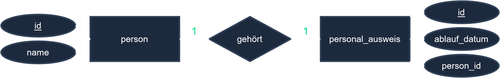
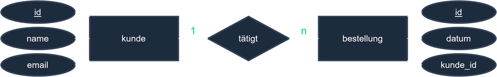
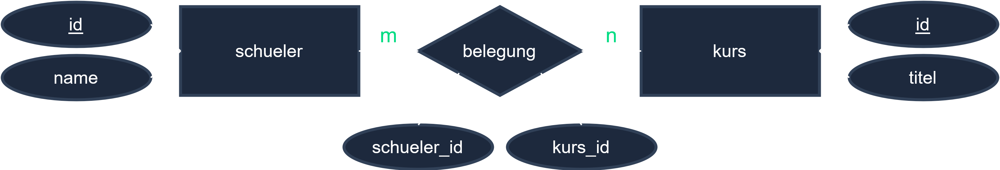
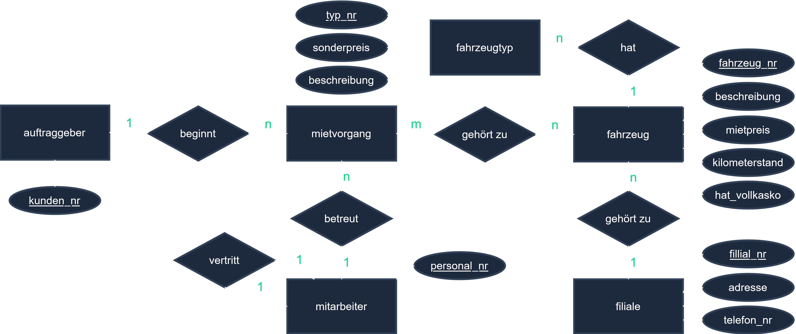

# ER-Modell (Entity-Relationship-Modell)

## Lernziele

Nach diesem Kapitel solltest du:
- Entitäten, Attribute und Beziehungen modellieren
- Kardinalitäten angeben
- Ein ER-Modell in Tabellen überführen

---

## Kerninhalt

### Bausteine

| Element | Darstellung | Beispiel |
|---------|-------------|----------|
| **Entität(styp)** | Rechteck | Kunde, Artikel |
| **Attribut** | Ellipse | Name, Preis |
| **Schlüsselattribut** | unterstrichenes Attribut | KundenID |
| **Beziehung** | Raute | „kauft“, „gehört zu“ |

### Kardinalitäten

Geben an, **wie viele** Entitäten einer Beziehung zueinander stehen:

| Typ | Bedeutung | Beispiel |
|-----|-----------|----------|
| **1:1** | genau eins zu eins | Person ↔ Personalausweis |
| **1:n** | eins zu vielen | Kategorie → Artikel |
| **n:m** | viele zu vielen | Student ↔ Kurs |

(Auch (min,max)-Notation gebräuchlich, z. B. (0,n).)

**Diagramm-Beispiele:**







<!-- Bildquelle: ap2.online (mit Genehmigung) -->

### Überführung ins relationale Modell

- **1:n** → Fremdschlüssel auf der „n“-Seite (die n-Tabelle bekommt den Schlüssel der 1-Seite).
- **n:m** → **Zwischentabelle (Verknüpfungstabelle)** mit zwei Fremdschlüsseln (n:m gibt es in relationalen DBs nicht direkt!).
- **1:1** → Fremdschlüssel auf einer Seite (oft mit UNIQUE).

```
Kategorie (1) ────< gehört zu >──── (n) Artikel
   ⇒ Artikel.KategorieID  (FOREIGN KEY)
```

---

## Wichtige Begriffe

| Begriff | Erklärung |
|---------|-----------|
| **Entität** | Objekt der realen Welt (Tabelle) |
| **Kardinalität** | Anzahlbeziehung (1:1, 1:n, n:m) |
| **Zwischentabelle** | Löst n:m in zwei 1:n auf |
| **Schlüsselattribut** | Eindeutiges Identifikationsmerkmal |

---

## Prüfungstipps

- **n:m wird über eine Zwischentabelle** aufgelöst – Standardaufgabe.
- Bei 1:n den Fremdschlüssel **auf der n-Seite** platzieren.
- ER-Modell zeichnen **und** in Tabellen (mit Schlüsseln) überführen können.

---

## Übungsaufgabe

**Aufgabe (nach ConSystem GmbH):** Modelliere für „Kunde bestellt Artikel“ ein ER-Modell mit Kardinalitäten und überführe die n:m-Beziehung in relationale Tabellen.

<details>
<summary>Lösungshinweis</summary>

Kunde (1) —< Bestellung >— (n) … und Bestellung enthält Artikel (n:m) → Zwischentabelle `Bestellposition (BestellID, ArtikelID, Menge)`.

</details>

---

## Beispiel-Diagramm



<!-- Bildquelle: ap2.online (mit Genehmigung) -->

---

## Querverweise

- [06-03-03 Normalisierung](./06-03-03-normalisierung.md)
- [06-03-01 SQL-Skript](./06-03-01-sql-skript.md)
