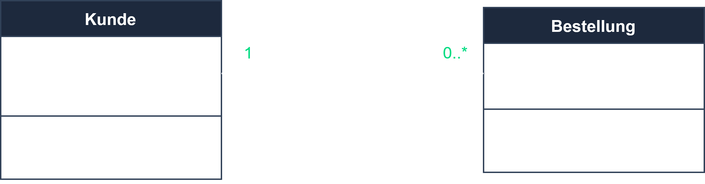
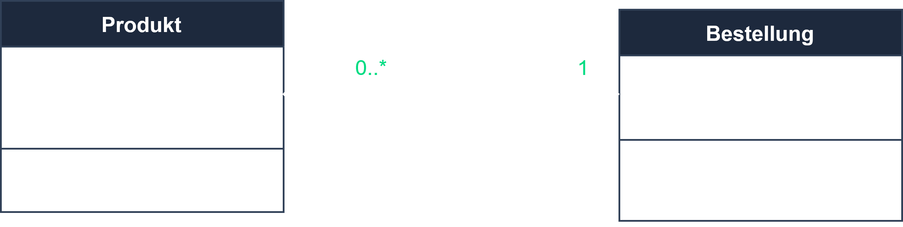
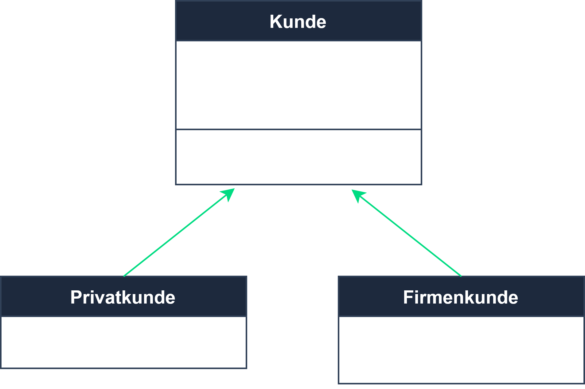

# Klassendiagramm

## Lernziele

Nach diesem Kapitel solltest du:
- Klassen mit Attributen, Methoden und Sichtbarkeiten darstellen
- Beziehungen (Assoziation, Aggregation, Komposition, Vererbung) mit Multiplizitäten modellieren
- Ein Klassendiagramm aus einer Beschreibung erstellen

---

## Kerninhalt

Das **Klassendiagramm** (Strukturdiagramm) ist das **zentrale UML-Diagramm** der OOP. Es zeigt Klassen, ihre Merkmale und Beziehungen.

### Aufbau einer Klasse

```
┌────────────────────┐
│      Konto         │   ← Klassenname
├────────────────────┤
│ - kontonummer:int  │   ← Attribute (mit Sichtbarkeit)
│ - saldo:double     │
├────────────────────┤
│ + einzahlen(b:double)│  ← Methoden
│ + abheben(b:double)  │
└────────────────────┘
```

**Sichtbarkeiten:** `+` public, `-` private, `#` protected, `~` package.

### Beziehungen

| Beziehung | Symbol | Bedeutung |
|-----------|--------|-----------|
| **Assoziation** | Linie | „kennt ein“ |
| **Aggregation** | leere Raute | „hat ein“ (Teil kann allein existieren) |
| **Komposition** | gefüllte Raute | „besteht aus“ (Teil stirbt mit dem Ganzen) |
| **Generalisierung/Vererbung** | Pfeil mit hohler Spitze | „ist ein“ |
| **Abhängigkeit** | gestrichelter Pfeil | „nutzt“ |

**Diagramm-Beispiele:**








<!-- Bildquelle: ap2.online (Platzhalter — vor Veröffentlichung durch eigene Grafik ersetzen, siehe assets/diagrams/README.md) -->

### Multiplizitäten

`1`, `0..1`, `*` (viele), `1..*` (mind. eins). Beispiel: `Kunde 1 ──── * Bestellung` (ein Kunde hat viele Bestellungen).

```
Person ◄─────────△ Kunde        (Vererbung: Kunde ist eine Person)
Bestellung ◆──── Bestellposition (Komposition)
```

---

## Wichtige Begriffe

| Begriff | Erklärung |
|---------|-----------|
| **Sichtbarkeit** | +/-/#/~ (public/private/protected/package) |
| **Aggregation vs. Komposition** | lose (leere Raute) vs. existenzabhängig (gefüllte Raute) |
| **Multiplizität** | Anzahl der beteiligten Objekte (1, *, 0..1, 1..*) |

---

## Prüfungstipps

- **Aggregation (leere Raute) vs. Komposition (gefüllte Raute)** – Klassiker.
- Sichtbarkeiten und Multiplizitäten korrekt eintragen.
- Enge Verbindung zur **OOP** ([06-02-03](../06-02-programmierung/06-02-03-oop.md)) und zum **ER-Modell** (DB).

---

## Übungsaufgabe

**Aufgabe:** Modelliere ein Klassendiagramm für `Kunde`, `Bestellung`, `Bestellposition`, `Artikel` mit Sichtbarkeiten, Multiplizitäten und passenden Beziehungen (inkl. einer Komposition).

---

## Querverweise

- [06-02-03 Objektorientierung (OOP)](../06-02-programmierung/06-02-03-oop.md)
- [06-03-02 ER-Modell](../06-03-datenbanken/06-03-02-er-modell.md)
