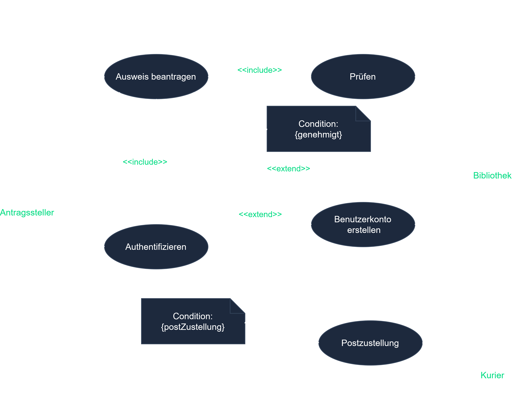

# Use-Case Diagram (Anwendungsfalldiagramm)

## Learning Objectives

After this chapter you should:
- Know the purpose and use of the use-case diagram in requirements analysis
- Confidently apply the notation elements (actor, use case, system boundary, relationships)
- Distinguish the relationships **association**, **`<<include>>`**, **`<<extend>>`** and **generalization (Vererbung / inheritance)**
- Be able to correctly complete an incomplete use-case diagram in the exam

---

## Core Content

### What is the use-case diagram for?

The **use-case diagram** (German: Anwendungsfalldiagramm) belongs to the **behavior diagrams** of UML. From the **user's perspective** it shows *what* a system should do – not *how*. It is the central tool of **requirements analysis** (GA1) and the first step before structure or process diagrams are created.

### Notation elements

| Element | Representation | Meaning |
|---------|-------------|-----------|
| **Actor (Akteur)** | stick figure | Role outside the system (person, another system) that interacts with the system |
| **Use case (Anwendungsfall)** | ellipse | A self-contained function useful to the actor |
| **System boundary (Systemgrenze)** | rectangle around the use cases | Separates the system (inside) from the environment (outside) |
| **Association** | solid line | Actor takes part in a use case |

### The relationships (exam-relevant!)

```
                 ┌─────────────── System: Kundenberatung ───────────────┐
                 │                                                       │
                 │      ( Kunde beraten ) ····<<include>>····> ( Kunden- │
   ┌──────┐      │            △                                 daten    │
   │Person│      │            │ Vererbung                       laden )  │
   └──┬───┘      │      ( Beratung dokumentieren )                       │
      │          │            ┆ <<extend>> (Bedingung:                   │
  ┌───┴───┐      │            ┆  „nur bei Neukunde")                     │
  │ Kunde │──────┼──── ( Kunde beraten )                                 │
  └───────┘      │                                                       │
 ┌─────────────┐ │                                                       │
 │Mitarbeiter/-│─┼──── ( Kunde beraten )                                 │
 │     in      │ │                                                       │
 └─────────────┘ └───────────────────────────────────────────────────┘
```

- **Association** (line): actor ↔ use case. *"The employee advises the customer."*
- **`<<include>>`** (dashed arrow, arrow points to the included case): the base use case **always uses** another one. *"Advise customer" always includes "load customer data".* Reuse of mandatory steps.
- **`<<extend>>`** (dashed arrow, arrow points to the base case): a use case **optionally extends** another – only under a **condition**. *"Grant welcome discount" extends "Advise customer", if new customer.*
- **Generalization / Vererbung (inheritance)** (arrow with hollow tip): a specialized actor/case inherits from a general one. *"Customer" and "Employee" are specializations of "Person".*

> **Memory aid:** `include` = **always** (mandatory), `extend` = **maybe** (condition). With `include` the arrow points **away from** the base case, with `extend` **towards** the base case.

---

## Key Terms

| Term | Explanation |
|---------|-----------|
| **Akteur (actor)** | External role that interacts with the system (not part of the system) |
| **Anwendungsfall (use case)** | Coherent functionality with recognizable benefit for the actor |
| **Systemgrenze (system boundary)** | Boundary between system and environment |
| **`<<include>>`** | Mandatory inclusion of another use case |
| **`<<extend>>`** | Conditional, optional extension of a use case |
| **Generalization** | Inheritance relationship (Vererbung) between actors or use cases |

---

## Exam Tips

- **UML is heavily weighted in AP2** – the use-case diagram is one of the most frequently tested diagrams. Practice it actively (draw it yourself), don't just read.
- **Typical task:** complete an *incomplete* diagram (add missing relationships/actors) – exactly the task format in the book (ConSystem GmbH).
- **Classic mistake:** confusing `include` and `extend`. Memorize the arrow direction **and** the semantics.
- **`<<extend>>` needs a condition** – name it explicitly when asked.
- Actor ≠ a concrete person, but a **role**. The same person can take on several roles.
- **Catalog note:** UML diagrams were strengthened in the updated exam catalog (among others, activity diagrams newly in AP1). In older practice exams the diagram selection may differ – see [Catalog changes](../../00-exam-overview/00-02-catalog-changes.md).

---

## Practice Exercise

**Starting scenario (after ConSystem GmbH):** For a software for *customer advising* a first draft of a use-case diagram exists. Still missing: a **generalization (Vererbung)**, an **`<<include>>` relationship**, an **`<<extend>>` relationship with a condition** as well as the **associations** of the actors.

**Task:** Complete the diagram sensibly.

<details>
<summary>Solution outline</summary>

- **Vererbung (inheritance):** "Customer" and "Employee" generalize to "Person".
- **Associations:** connect "Customer" and "Employee" each with "Advise customer".
- **`<<include>>`:** "Advise customer" ⟶ "Load customer data" (always needed).
- **`<<extend>>`:** "Grant welcome discount" ⟶ "Advise customer", condition: *only for new customers*.

</details>

---

## Example Diagram



<!-- Bildquelle: ap2.online (mit Genehmigung) -->

---

## Cross-References

- [06-04-01 UML in general](./06-04-01-uml-allgemein.md) – Overview of all UML diagram types
- [06-04-03 Sequence Diagram (Sequenzdiagramm)](./06-04-03-sequenzdiagramm.md) – Process of a use case in detail
- [06-04-04 Activity Diagram (Aktivitätsdiagramm)](./06-04-04-aktivitaetsdiagramm.md) – Process view
- [06-01-02 Planning an application (requirements analysis)](../06-01-schnittstellen-planung/06-01-02-planung-anwendung.md) – where use cases come from
