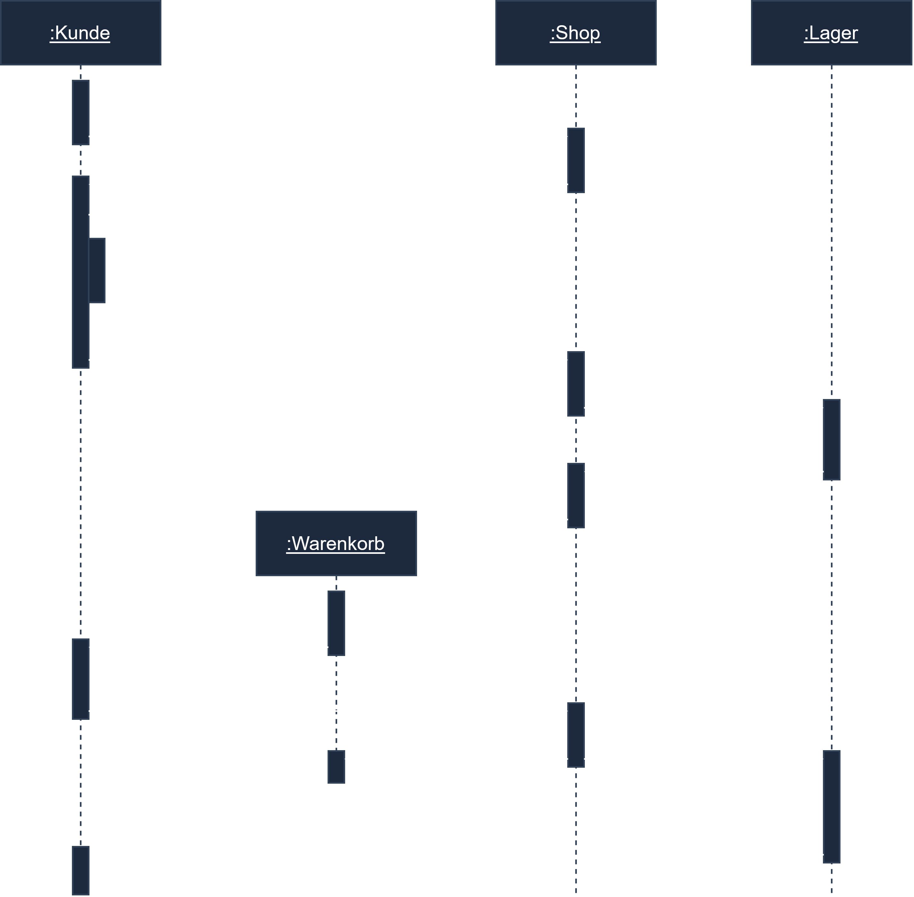

# Diagrama de Secuencia (Sequenzdiagramm)

## Objetivos de Aprendizaje

Después de este capítulo deberías:
- Conocer la estructura y los elementos de un diagrama de secuencia
- Distinguir mensajes síncronos/asíncronos y retornos
- Representar un proceso como diagrama de secuencia

---

## Contenido Principal

El **diagrama de secuencia** (diagrama de comportamiento/interacción) muestra la **secuencia temporal de mensajes** entre objetos. **El tiempo transcurre de arriba hacia abajo.**

### Elementos

| Elemento | Representación |
|---------|-------------|
| **Objeto/actor** | recuadro en la parte superior (`:Clase` o `objeto:Clase`) |
| **Línea de vida (Lebenslinie)** | línea vertical discontinua |
| **Barra de activación (Aktivierungsbalken)** | rectángulo estrecho (el objeto está activo) |
| **Mensaje síncrono** | flecha continua, punta **rellena** (espera respuesta) |
| **Mensaje asíncrono** | flecha continua, punta **abierta** |
| **Retorno (Return)** | flecha discontinua |

```
:Client        :Service       :Datenbank
   │  anfrage()   │              │
   ├─────────────►│  query()     │
   │              ├─────────────►│
   │              │◄─ ─ ─ ergebnis
   │◄─ ─ ─ antwort│              │
```

Extensiones: **fragmentos** como `alt` (alternativa), `opt` (opcional), `loop` (bucle).

---

## Términos Clave

| Término | Explicación |
|---------|-----------|
| **Lebenslinie (línea de vida)** | Existencia de un objeto a lo largo del tiempo |
| **Aktivierungsbalken (barra de activación)** | Período durante el cual un objeto está activo |
| **Síncrono/Asíncrono** | Con/sin espera de respuesta |
| **Fragmento (alt/opt/loop)** | Estructuras de control en el diagrama |

---

## Consejos para el Examen

- **Tiempo = vertical (arriba→abajo)** – se pregunta con frecuencia.
- Distinguir **síncrono (punta rellena) vs. asíncrono (punta abierta)**.
- Tarea típica: añadir mensajes/retornos que faltan (p. ej. para un acceso a base de datos).

---

## Ejercicio Práctico

**Tarea (según ConSystem GmbH):** En un diagrama de secuencia para un acceso actualizado a la base de datos, añade los mensajes que faltan entre cliente, servicio y base de datos (incluidos los retornos).

---

## Diagrama de Ejemplo



<!-- Bildquelle: ap2.online (mit Genehmigung) -->

---

## Referencias

- [06-04-02 Diagrama de Casos de Uso (Anwendungsfalldiagramm)](./06-04-02-use-case-diagramm.md)
- [06-04-04 Diagrama de Actividad (Aktivitätsdiagramm)](./06-04-04-aktivitaetsdiagramm.md)
