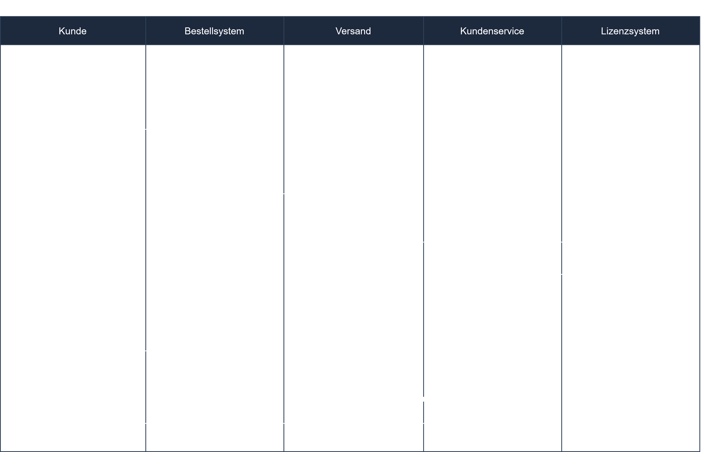

# Diagrama de Actividad (Aktivitätsdiagramm)

## Objetivos de Aprendizaje

Después de este capítulo deberías:
- Conocer los elementos de un diagrama de actividad
- Representar bifurcaciones y paralelismo (fork/join)
- Convertir un diagrama de flujo en un diagrama de actividad

---

## Contenido Principal

El **diagrama de actividad** (diagrama de comportamiento) representa **procesos/flujos** – similar a un diagrama de flujo, pero con notación UML y soporte para el paralelismo.

### Elementos

| Elemento | Representación |
|---------|-------------|
| **Nodo inicial** | círculo relleno |
| **Nodo final** | círculo con un anillo |
| **Acción** | rectángulo redondeado |
| **Decisión/unión** | **rombo** (con condiciones `[...]`) |
| **Fork/Join (paralelismo)** | barra gruesa (dividir/unir) |
| **Swimlane (partición)** | columna por responsable/rol |

```
 ● → [comprobar solicitud] → ◇ [¿válido?] ──sí──► [procesar] → ⊗
                                └───no──► [rechazar] ──────────┘
```

- **Decisión (rombo):** una entrada, varias salidas condicionales `[sí]/[no]`.
- **Fork/Join (barra):** varias acciones se ejecutan **en paralelo** y se vuelven a unir.
- **Swimlanes:** asignan las acciones a los roles/departamentos que las ejecutan.

---

## Términos Clave

| Término | Explicación |
|---------|-----------|
| **Entscheidungsknoten (nodo de decisión)** | Rombo con salidas condicionales |
| **Fork/Join** | División/unión de flujos paralelos |
| **Swimlane** | Asignación de acciones a roles |

---

## Consejos para el Examen

- **Rombo = decisión** (bifurcación condicional), **barra = paralelismo** – no los confundas.
- Los diagramas de actividad están **recién enfatizados** en el catálogo actualizado.
- Tarea típica: convertir un **diagrama de flujo en un diagrama de actividad**.

---

## Ejercicio Práctico

**Tarea (según ConSystem GmbH):** Convierte el diagrama de flujo dado para el proceso «formaciones para clientes» en un diagrama de actividad UML (con decisiones y, si procede, swimlanes).

---

## Diagrama de Ejemplo



<!-- Bildquelle: ap2.online (mit Genehmigung) -->

---

## Referencias

- [06-04-06 Diagrama de Estados (Zustandsdiagramm)](./06-04-06-zustandsdiagramm.md)
- [06-04-03 Diagrama de Secuencia (Sequenzdiagramm)](./06-04-03-sequenzdiagramm.md)
