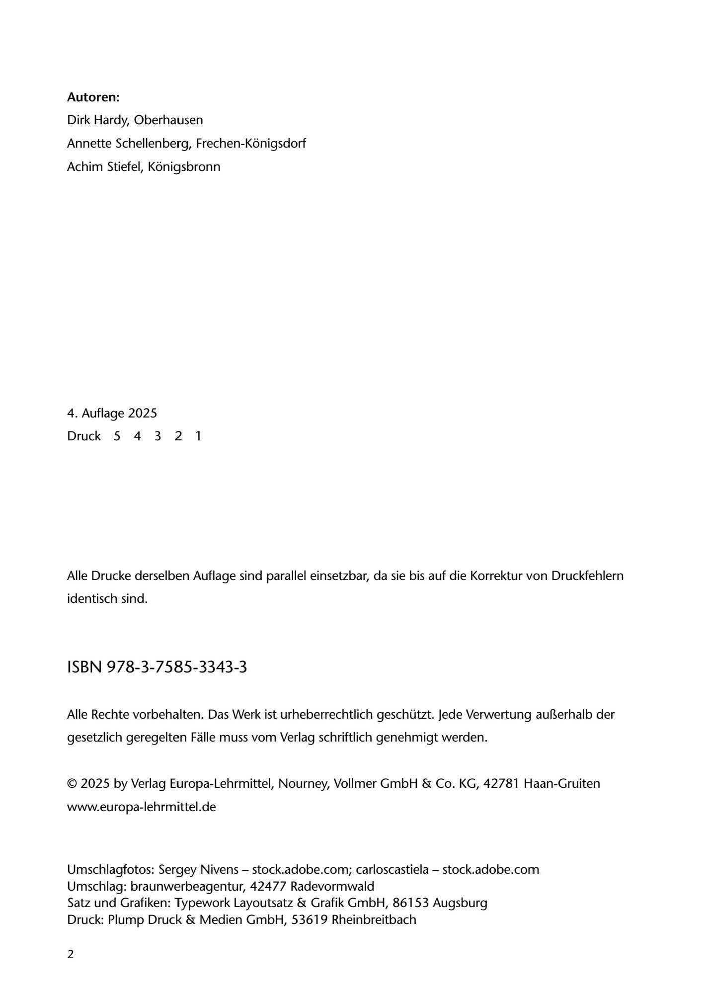

---
## Page 4
---

### Autoren:

Dirk Hardy, Oberhausen

Annette Schellenberg, Frechen-Konigsdorf

Achim Stiefel, Konigsbronn

4. Auflage 2025

Druck 5 4 3 2 1

Alle Drucke derselben Auflage sind parallel einsetzbar, da sie bis auf die Korrektur von Druckfehlern

identisch sind.

## ISBN 978-3-7585-3343-3

Alle Rechte vorbehalten. Das Werk ist urheberrechtlich geschützt. Jede Verwertung au~erhalb der

gesetzlich geregelten Falle muss vom Verlag schriftlich genehmigt werden.

© 2025 by Verlag Europa-Lehrmittel, Nourney, Vollmer GmbH & Co. KG, 42781 Haan-Gruiten

www.europa-lehrmittel.de

Umschlagfotos: Sergey Nivens - stock.adobe.com; carloscastiela - stock.adobe.com Umschlag: braunwerbeagentur, 42477 Radevormwald Satz und Grafiken: Typework Layoutsatz & Grafik GmbH, 86153 Augsburg Druck: Plump Druck & Medien GmbH, 53619 Rheinbreitbach

2

<!-- IMAGE: page-004-img-1.jpeg - TODO: Add description -->
