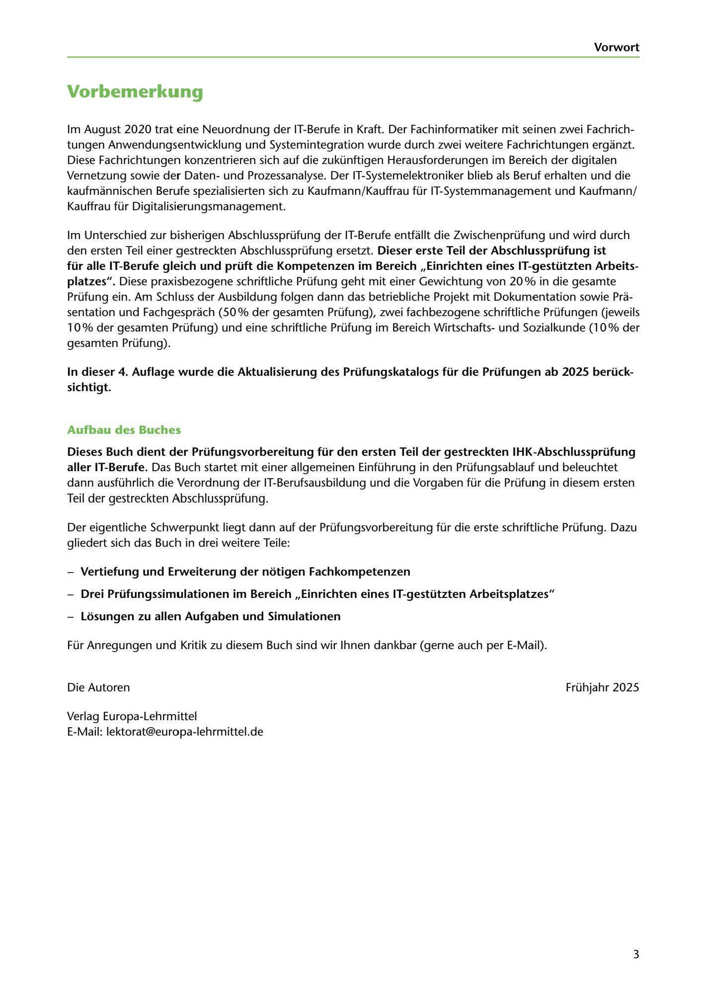

---
## Page 5
---

### Vorwort

# Vorbemerkung

lm August 2020 trat eine Neuordnung der IT-Berufe in Kraft. Der Fachinformatiker mit seinen zwei Fachrich- tungen Anwendungsentwicklung und Systemintegration wurde durch zwei weitere Fachrichtungen erganzt.

Diese Fachrichtungen konzentrieren sich auf die zukünftigen Herausforderungen im Bereich der digitalen Vernetzung sowie der Datenund Prozessanalyse. Der IT-Systemelektroniker blieb als Beruf erhalten und die kaufmannischen Berufe spezialisierten sich zu Kaufmann/Kauffrau für IT-Systemmanagement und Kaufmann/ Kauffrau für Digitalisierungsmanagement.

lm Unterschied zur bisherigen Abschlussprüfung der IT-Berufe entfüllt die Zwischenprüfung und wird durch den ersten Teil einer gestreckten Abschlussprüfung ersetzt. Dieser erste Teil der Abschlussprüfung ist für alle IT-Berufe gleich und prüft die Kompetenzen im Bereich ,,Einrichten eines IT-gestützten Arbeits- platzes". Diese praxisbezogene schriftliche Prüfung geht mit einer Gewichtung von 20% in die gesamte Prüfung ein. Am Schluss der Ausbildung folgen dann das betriebliche Projekt mit Dokumentation sowie Pra- sentation und Fachgesprach (50% der gesamten Prüfung), zwei fachbezogene schriftliche Prüfungen (jeweils

10% der gesamten Prüfung) und eine schriftliche Prüfung im Bereich Wirtschaftsund Sozialkunde (1 O% der gesamten Prüfung).

### sichtigt.

In dieser 4. Auflage wurde die Aktualisierung des Prüfungskatalogs für die Prüfungen ab 2025 berück-

### Aufbau des Buches

Dieses Buch dient der Prüfungsvorbereitung für den ersten Teil der gestreckten IHK-Abschlussprüfung aller IT-Berufe. Das Buch startet mit einer allgemeinen Einführung in den Prüfungsablauf und beleuchtet dann ausführlich die Verordnung der IT-Berufsausbildung und die Vorgaben für die Prüfung in diesem ersten Teil der gestreckten Abschlussprüfung.

Der eigentliche Schwerpunkt liegt dann auf der Prüfungsvorbereitung für die erste schriftliche Prüfung. Dazu gliedert sich das Buch in drei weitere Teile:

### Vertiefung und Erweiterung der notigen Fachkompetenzen

-

- Drei Prüfungssimulationen im Bereich ,,Einrichten eines IT-gestützten Arbeitsplatzes"

### Losungen zu allen Aufgaben und Simulationen

-

Für Anregungen und Kritik zu diesem Buch sind wir lhnen dankbar (gerne auch per E-Mail).

Die Autoren Frühjahr 2025

Verlag Europa-Lehrmittel E-Mail: lektorat@europa-lehrmittel.de

3

<!-- IMAGE: page-005-img-1.jpeg - TODO: Add description -->
