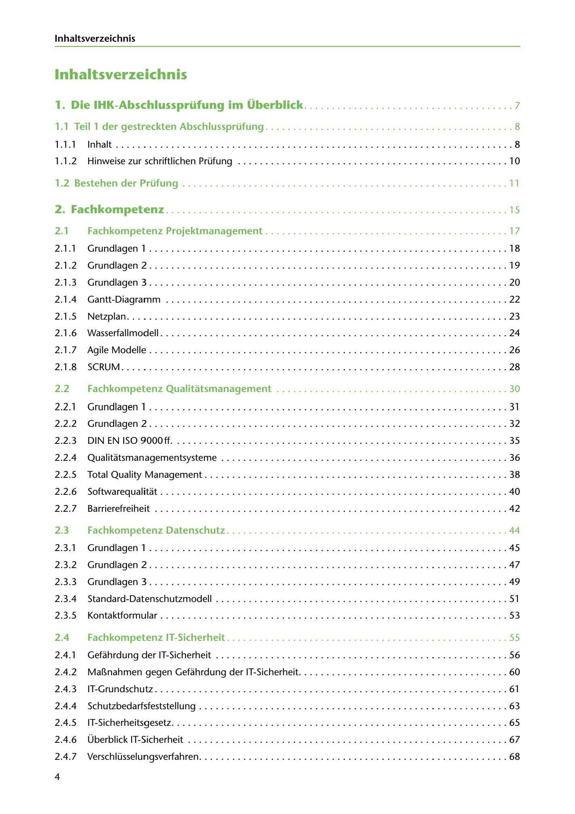

---
## Page 6
---

lnhaltsverzeichnis

# lnhaltsverzeichnis

# 1. Die IHK-Abschlussprüfung im Überblick ...................................... 7

# 1.1 Teil 1 der gestreckten Abschlussprüfung ............................................. 8

1 . 1 . 1 lnhalt ........................................................................ 8

1. 1 .2 Hinweise zur schriftlichen Prüfung ................................................. 1 O

# 1.2 Bestehen der Prüfung ... . ....................................................... 1 1

# 2. Fachkompetenz . ............................................................. 15

### 2.1

Fachkompetenz Projektmanagement ............................................ 1 7

### 2. 1 .1

# Grundlagen 11 ................................................................. 18

2. 1 .2 Grundlagen 2 ................................................. ... ........ . .... 19

# Grundlagen 3 ................................................................. 20

2. 1. 3

2. 1 .4 Gantt-Diagramm .............................................................. 22

2. 1 .5 Netzplan ................ . ......... . ................ . ......... . ............... 23

2. 1 .6 Wasserfallmodell ..................................... . ......................... 24

2.1.7 AgileModelle ................................................................. 26

2. 1 .8 SCRUM ................................................... . ............. . .... 28

### 2.2

## Fachkompetenz Qualitatsmanagement .......................................... 30

# Grundlagen 11 ................................... . ....... . ................ . .... 31

2.2. 1

# Grundlagen 2 ................................. . ............ . ............. . .... 32

2.2.2

# DIN EN ISO 9000ft ........................................................ . .... 35

2.2.3

2.2.4 Qualitatsmanagementsysteme .................................................... 36

2.2.5 Total Quality Management .. . .. . ......... . ....................................... 38

2.2.6 Softwarequalitat .......... . .. . ....................... . ......... . ..... . ...... ... 40

2.2.7 Barrierefreiheit ...................................... . ... . ..................... 42

### 2.3

Fachkompetenz Datenschutz . .................................................. 44

### 2.3. 1

# Grundlagen 11 ..... . ......... . ....................... . ......................... 45

2.3.2 Grundlagen 2 ........ . ... .. . . ...... .. . . ...... .. . .. . . . ... . . .. . .. ............... 47

2.3.3 Grundlagen 3 ....................................... . ......................... 49

2.3.4 Standard-Datenschutzmodell ..................................................... 51

2.3.5 Kontaktformular .......... . .. .... ... ....... ... ..... . . . .................... . .... 53

# Fachkompetenz IT-Sicherheit ................................................... 55

2.4

2.4. 1 Gefahrdung der IT-Sicherheit ... . ...... ....... .... ...... . ......... . .. .... .... ..... 56

2.4.2 Ma~nahmen gegen Geführdung der IT-Sicherheit ...................................... 60

2.4.3 IT-Grundschutz . ............................................ . ............. . .... 61

2.4.4 Schutzbedarfsfeststellung ........................... . ............................ 63

2.4.5 IT-Sicherheitsgesetz ................................ . ...... . .. . ............. . .... 65

2.4.6 Überblick IT-Sicherheit .......................................................... 67

2.4.7 Verschlüsselungsverfahren ... . .. . .. . ... .. . . ...... . .. .. . . .... . . .. . . ................ 68

4

<!-- IMAGE: page-006-img-1.jpeg - TODO: Add description -->
