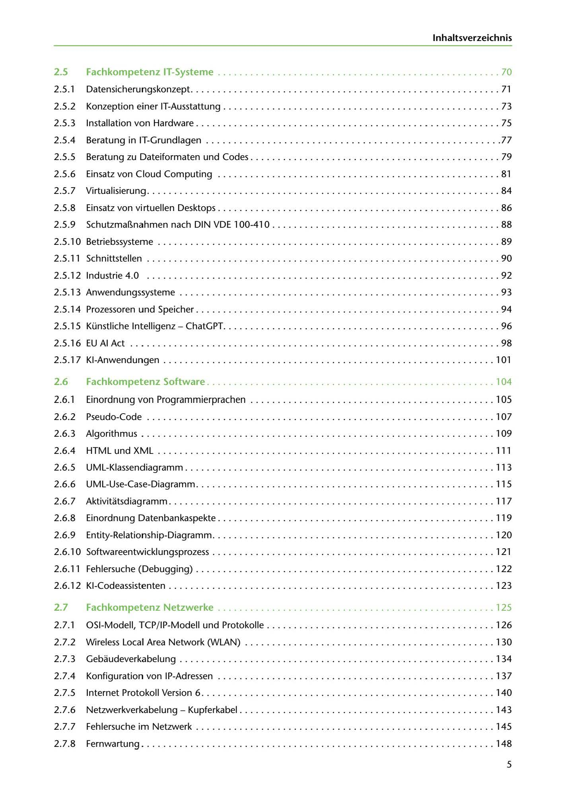

---
## Page 7
---

lnhaltsverzeichnis

2.5 Fachkompet enz IT-Systeme .................................................... 70

2.5.1 Datensicherungskonzept ......................................................... 71

2.5.2 Konzeption einer IT-Ausstattung ................................................... 73

2.5.3 lnstallation van Hardware ........................................................ 75

2.5.4 Beratung in IT-Grundlagen ..................................................... 77

2.5.5 Beratung zu Dateiformaten und Codes .............................................. 79

2.5.6 Einsatz von Cloud Computing .................................................... 81

2.5.7 Virtualisierung ................................................................. 84

2.5.8 Einsatz von virtuellen Desktops ............................................... ..... 86

2.5.9 Schutzmaí1nahmen nach DIN VDE 100-41 O ..................................... . .... 88

2.5.1 O Betriebssysteme ............................................................... 89

2.5.11 Schnittstellen ................................................................. 90

2.5.12 Industrie 4.0 ................................................................. 92

2.5.13 Anwendungssysteme .. . ... ....... ... ................. .... ......... ............. 93

2.5.14 Prozessoren und Speicher ................................................... . .... 94

2.5.15 Künstliche lntelligenz - ChatGPT ................................................... 96

2.5.16 EU Al Act .............. .. ..... . ...... . .. ... ....... . .... . ............... ..... . 98

2.5.1 7 KI-Anwendungen ......................................................... . ... 101

### 2.6

Fachkompetenz Software . .................................................... 104

2.6.1 Einordnung van Programmierprachen ............................................. 105

2.6.2 Pseudo-Code ............................................................ . ... 107

2.6. 3 Algorithmus ............................................................. . ... 109

2.6.4 HTML und XML ... . ...... .. . . ...... .. . .. ..... .. .. . ...... . . .. .. .. ............. 111

2.6.5 UML-Klassendiagramm . . ......... .. ............................................ 11 3

2.6.6 UML-Use-Case-Diagramm ...... ...................................... .. ..... . ... 11 5

2.6. 7 Aktivitatsdiagramm . . ...... . .. . ................. . ......... . .................... 11 7

2.6.8 Einordnung Datenbankaspekte .. . ................................................ 11 9

2.6. 9 Entity-Relationship-Diagramm ................................................ . ... 120

2.6.1 O Softwareentwicklungsprozess ........................... ......... . ............... 121

2.6.11 Fehlersuche (Debugging) ....................................................... 122

2.6.12 KI-Codeassistenten ........................................................ . ... 123

### 2.7

## Fachkompetenz Netzwerke ................................................... 125

2.7.1 OSI-Modell, TCP/IP-Modell und Protokolle ................. ... ...................... 126

2.7.2 Wireless Local Area Network (WLAN) . .. .... .................................. ... .. 130

2.7.3 Gebaudeverkabelung ...................................................... . .. . 134

2.7.4 Konfiguration von IP-Adressen . . . ...... .. . .. ..... . .. .. . . ...... .. . . ............... 137

2. 7 .5 Internet Protokoll Version 6 .. . .. . ......... . ....... . ......... . .................... 140

2.7.6 Netzwerkverkabelung - Kupferkabel ........................................... . ... 143

2.7.7 Fehlersuche im Netzwerk ....................................... . ............... 145

2.7.8 Fernwartung ................................................................. 148

5

<!-- IMAGE: page-007-img-1.jpeg - TODO: Add description -->
