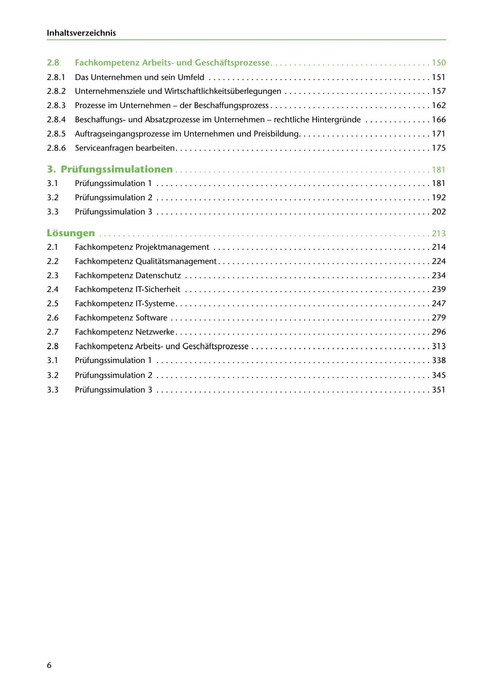

---
## Page 8
---

### lnhaltsverzeichnis

# Fachkompetenz Arbeitsund Geschaftsprozesse .................................. 150

2.8

2.8.1 Das Unternehmen und sein Umfeld ............................................... 151

2.8.2 Unternehmensziele und Wirtschaftlichkeitsüberlegungen ............................... 157

2.8.3 Prozesse im Unternehmen - der Beschaffungsprozess .................................. 162

2.8.4 Beschaffungsund Absatzprozesse im Unternehmen - rechtliche Hintergründe .............. 166

2.8.5 Auftragseingangsprozesse im Unternehmen und Preisbildung ............................ 171

2.8.6 Serviceanfragen bearbeiten ...................................................... 175

# 3. Prüfungssimulationen ...................................................... 181

# Prüfungssimulation 1 .......................................................... 181

3.1

# Prüfungssimulation 2 .......................................................... 192

3.2

# Prüfungssimulation 3 .............................. . ............ . .............. 202

3.3

# Losungen ...................................................................... 21 3

2.1 Fachkompetenz Projektmanagement .......................................... . ... 214

2.2 Fachkompetenz Qualitatsmanagement ....................... . ..................... 224

2.3 Fachkompetenz Datenschutz . ..... . ... .. . . .. .. ..... .. . . . . .. . ...... . ........ ... . . 234

2.4 Fachkompetenz IT-Sicherheit .................................................... 239

2.5 Fachkompetenz IT-Systeme ...................................................... 247

2.6 Fachkompetenz Software ................................................... . .. . 279

2.7 Fachkompetenz Netzwerke ............................. . .................... . ... 296

2.8 Fachkompetenz Arbeitsund Geschaftsprozesse . ............ . ......... ..... .......... 313

3.1 Prüfungssimulation 1 .. . ... . .. . ............ . .... . .... . . . .. . .... . . . ........ ... .. 338

# Prüfungssimulation 2 .......................................................... 345

3.2

# Prüfungssimulation 3 .......................................................... 351

3.3

6

<!-- IMAGE: page-008-img-1.jpeg - TODO: Add description -->
