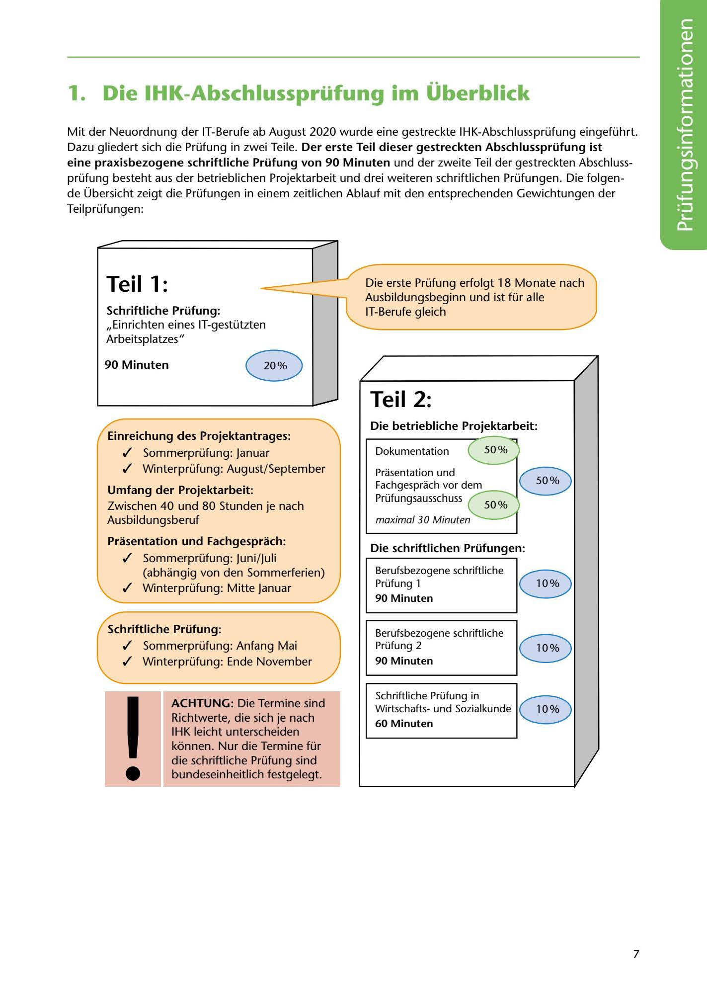

---
## Page 9
---

# 1. Die IHK-Abschlussprüfung im Überblick

Mit der Neuordnung der IT-Berufe ab August 2020 wurde eine gestreckte IHK-Abschlussprüfung eingeführt. Dazu gliedert sich die Prüfung in zwei Teile. Der erste Teil dieser gestreckten Abschlussprüfung ist eine praxisbezogene schriftliche Prüfung von 90 Minuten und der zweite Teil der gestreckten Abschluss- prüfung besteht aus der betrieblichen Projektarbeit und drei weiteren schriftlichen Prüfungen. Die folgen- de Übersicht zeigt die Prüfungen in einem zeitlichen Ablauf mit den entsprechenden Gewichtungen der Teilprüfungen:

# Teil 1:

### Die erste Prüfung erfolgt 18 Monate nach

Ausbildungsbeginn und ist für alle IT-Berufe gleich

<!-- IMAGE: page-009-img-1.jpeg - TODO: Add description -->

### Schriftliche Prüfung:

,,Einrichten eines IT-gestützten Arbeitsplatzes"

### 90 Minuten

# ~

# Teil 2:

### Die betriebliche Projektarbeit:

### Einreichung des Projektantrages:

Dokumentation

✓ Sommerprüfung: Januar

✓ Winterprüfung: August/September

Prasentation und Fachgesprach vor dem Prüfungsausschuss

**[VISUAL: EXAM TIMELINE DIAGRAM]**
Timeline showing the structure of the IHK IT apprenticeship final examination with weightings for each component.

maximal 30 Minuten

### Urnfang der Projektarbeit:

Zwischen 40 und 80 Stunden je nach Ausbildungsberuf

### Prasentation und Fachgesprach:

### Die schriftlichen Prüfungen:

✓ Sommerprüfung: Juni/Juli (abhangig von den Sommerferien)

✓ Winterprüfung: Mitte Januar

**[VISUAL: EXAM TIMELINE DIAGRAM]**
Timeline showing the structure of the IHK IT apprenticeship final examination with weightings for each component.

### 90 Minuten

Berufsbezogene schriftliche Prüfung 1

### Schriftliche Prüfung:

✓ Sommerprüfung: Anfang Mai

**[VISUAL: EXAM TIMELINE DIAGRAM]**
Timeline showing the structure of the IHK IT apprenticeship final examination with weightings for each component.

### 90 Minuten

Berufsbezogene schriftliche Prüfung 2

✓ Winterprüfung: Ende November

### ACHTUNG: Die Termine sind

# B

### 60 Minuten

Schriftliche Prüfung in Wirtschaftsund Sozialkunde 1 O%

Richtwerte, die sich je nach IHK leicht unterscheiden kónnen. Nur die Termine für die schriftliche Prüfung sind bundeseinheitlich festgelegt.

**[VISUAL: EXAM TIMELINE DIAGRAM]**
Timeline showing the structure of the IHK IT apprenticeship final examination with weightings for each component.

# 1

# •

7
