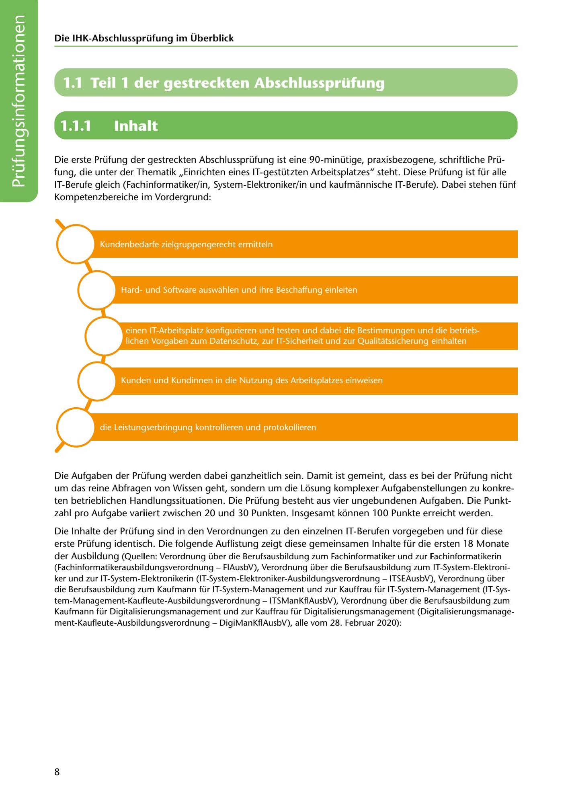

---
## Page 10
---

### Die IHK-Abschlussprüfung im Überblick

# 1.1 Teil 1 der gestreckten Abschlussprüfung

# 1.1.1

# lnhalt

<!-- IMAGE: page-010-img-1.jpeg - TODO: Add description -->

Die erste Prüfung der gestreckten Abschlussprüfung ist eine 90-minütige, praxisbezogene, schriftliche Prü- fung, die unter der Thematik ,,Einrichten eines IT-gestützten Arbeitsplatzes" steht. Diese Prüfung ist für alle IT-Berufe gleich (Fachinformatiker/ in, System-Elektroniker/in und kaufmannische IT-Berufe). Dabei stehen fünf Kompetenzbereiche im Vordergrund:

**[VISUAL: FIVE COMPETENCY AREAS DIAGRAM]**
Diagram showing the five competency areas tested in Part 1 of the extended final examination for IT professions.

Die Aufgaben der Prüfung werden dabei ganzheitlich sein. Damit ist gemeint, dass es bei der Prüfung nicht um das reine Abfragen von Wissen geht, sondern um die Losung komplexer Aufgabenstellungen zu konkre- ten betrieblichen Handlungssituationen. Die Prüfung besteht aus vier ungebundenen Aufgaben. Die Punkt- zahl pro Aufgabe variiert zwischen 20 und 30 Punkten. lnsgesamt konnen 100 Punkte erreicht werden.

Die lnhalte der Prüfung sind in den Verordnungen zu den einzelnen IT-Berufen vorgegeben und für diese erste Prüfung identisch. Die folgende Auflistung zeigt diese gemeinsamen lnhalte für die ersten 18 Monate der Ausbildung (Quellen: Verordnung über die Berufsausbildung zum Fachinformatiker und zur Fachinformatikerin (Fachinformatikerausbildungsverordnung - FIAusbV), Verordnung über die Berufsausbildung zum IT-System-Elektroni- ker und zur IT-System-Elektronikerin (IT-System-Elektroniker-Ausbildungsverordnung - ITSEAusbV), Verordnung über die Berufsausbildung zum Kaufmann für IT-System-Management und zur Kauffrau für IT-System-Management (IT-Sys- tem-Management-Kaufleute-Ausbildungsverordnung - ITSManKflAusbV), Verordnung über die Berufsausbildung zum Kaufmann für Digitalisierungsmanagement und zur Kauffrau für Digitalisierungsmanagement (Digitalisierungsmanage- ment-Kaufleute-Ausbildungsverordnung - DigiManKflAusbV), alle vom 28. Februar 2020):

8
