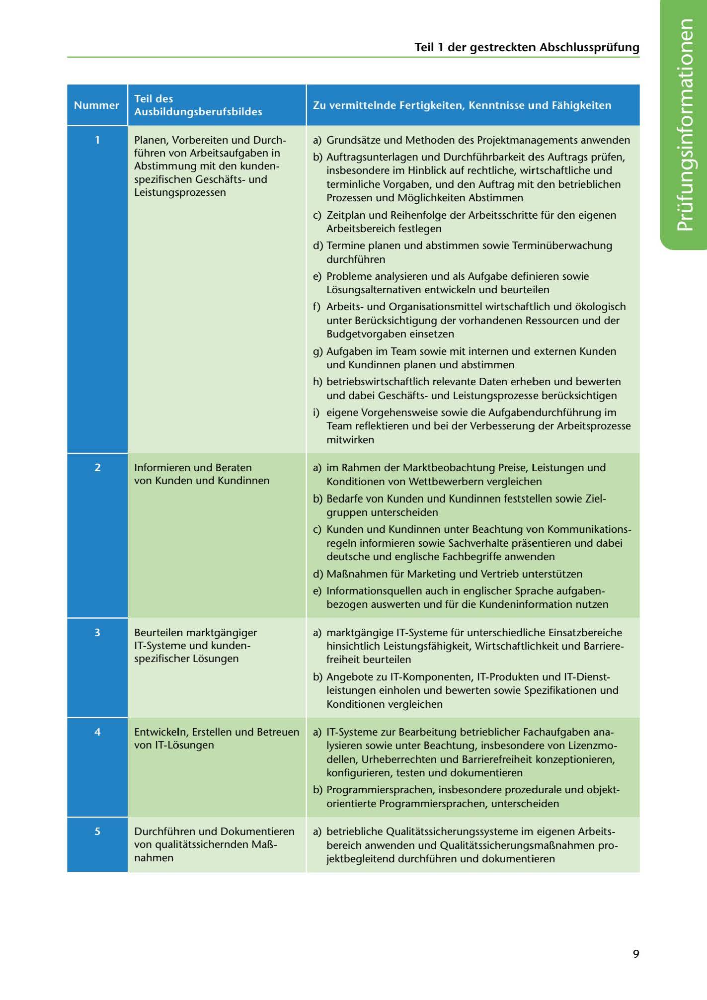

---
## Page 11
---

### Teil 1 der gestreckten Abschlussprüfung

### Zu vermittelnde Fertigkeiten, Kenntnisse und Fahigkeiten

### Teil des

### Ausbildungsberufsbildes

a) Grundsatze und Methoden des Projektmanagements anwenden

# -

Planen, Vorbereiten und Durch- führen von Arbeitsaufgaben in Abstimmung mit den kunden- spezifischen Geschaftsund Leistungsprozessen

b) Auftragsunterlagen und Durchführbarkeit des Auftrags prüfen, insbesondere im Hinblick auf rechtliche, wirtschaftliche und terminliche Vorgaben, und den Auftrag mit den betrieblichen Prozessen und Moglichkeiten Abstimmen

e) Zeitplan und Reihenfolge der Arbeitsschritte für den eigenen Arbeitsbereich festlegen

d) Termine planen und abstimmen sowie Terminüberwachung

durchführen

e) Probleme analysieren und als Aufgabe definieren sowie Losungsalternativen entwickeln und beurteilen

f) Arbeitsund Organisationsmittel wirtschaftlich und okologisch unter Berücksichtigung der vorhandenen Ressourcen und der Budgetvorgaben einsetzen

g) Aufgaben im Team sowie mit internen und externen Kunden und Kundinnen planen und abstimmen

h) betriebswirtschaftlich relevante Daten erheben und bewerten und dabei Geschaftsund Leistungsprozesse berücksichtigen

i) eigene Vorgehensweise sowie die Aufgabendurchführung im Team reflektieren und bei der Verbesserung der Arbeitsprozesse mitwirken

lnformieren und Beraten von Kunden und Kundinnen

a) im Rahmen der Marktbeobachtung Preise, Leistungen und Konditionen von Wettbewerbern vergleichen

b) Bedarfe von Kunden und Kundinnen feststellen sowie Ziel- gruppen unterscheiden

e) Kunden und Kundinnen unter Beachtung von Kommunikations- regeln informieren sowie Sachverhalte prasentieren und dabei deutsche und englische Fachbegriffe anwenden

d) MaBnahmen für Marketing und Vertrieb unterstützen

e) lnformationsquellen auch in englischer Sprache aufgaben- bezogen auswerten und für die Kundeninformation nutzen

Beurteilen marktgangiger IT-Systeme und kunden- spezifischer Losungen

a) marktgangige IT-Systeme für unterschiedliche Einsatzbereiche hinsichtlich Leistungsfahigkeit, Wirtschaftlichkeit und Barriere- freiheit beurteilen

b) Angebote zu IT-Komponenten, IT-Produkten und IT-Dienst-

leistungen einholen und bewerten sowie Spezifikationen und Konditionen vergleichen

Entwickeln, Erstellen und Betreuen von IT-Losungen

a) IT-Systeme zur Bearbeitung betrieblicher Fachaufgaben ana- lysieren sowie unter Beachtung, insbesondere von Lizenzmo- dellen, Urheberrechten und Barrierefreiheit konzeptionieren, konfigurieren, testen und dokumentieren

b) Programmiersprachen, insbesondere prozedurale und objekt- orientierte Programmiersprachen, unterscheiden

Durchführen und Dokumentieren von qualitatssichernden MaB- nahmen

a) betriebliche Qualitatssicherungssysteme im eigenen Arbeits- bereich anwenden und QualitatssicherungsmaBnahmen pro- jektbegleitend durchführen und dokumentieren

<!-- IMAGE: page-011-img-1.jpeg - TODO: Add description -->

9
