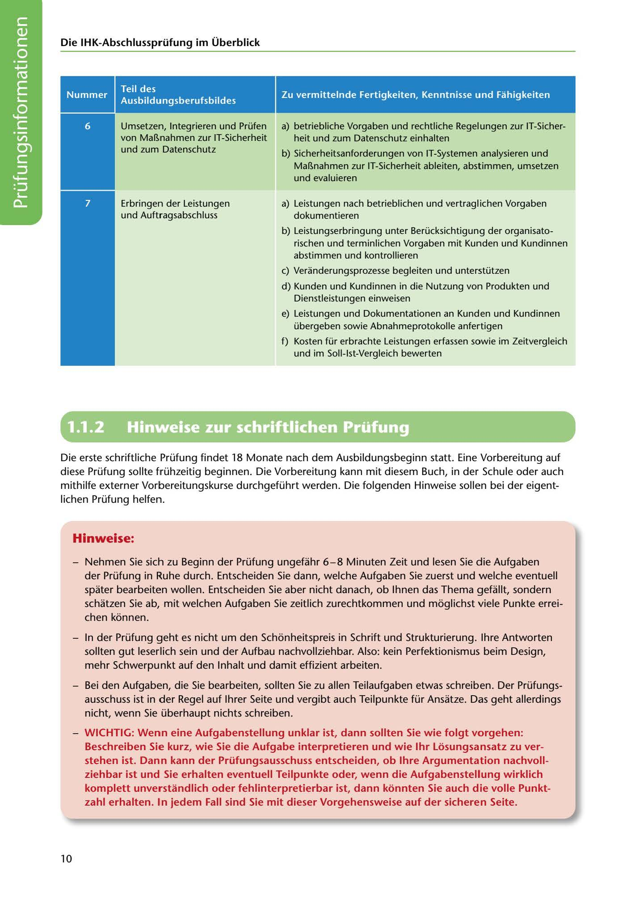

---
## Page 12
---

### Teil des

### Ausbildungsberufsbildes

Zu vermittelnde Fertigkeiten, Kenntnisse und Fahigkeiten

a) betriebliche Vorgaben und rechtliche Regelungen zur IT-Sicher- heit und zum Datenschutz einhalten

### Die IHK-Abschlussprüfung im Überblick

# -

Umsetzen, lntegrieren und Prüfen von Ma~nahmen zur IT-Sicherheit und zum Datenschutz

b) Sicherheitsanforderungen von IT-Systemen analysieren und

Ma~nahmen zur IT-Sicherheit ableiten, abstimmen, umsetzen und evaluieren

a) Leistungen nach betrieblichen und vertraglichen Vorgaben

Erbringen der Leistungen und Auftragsabschluss

dokumentieren

<!-- IMAGE: page-012-img-1.jpeg - TODO: Add description -->

b) Leistungserbringung unter Berücksichtigung der organisato- rischen und terminlichen Vorgaben mit Kunden und Kundinnen abstimmen und kontrollieren

e) Veranderungsprozesse begleiten und unterstützen

d) Kunden und Kundinnen in die Nutzung von Produkten und

Dienstleistungen einweisen

e) Leistungen und Dokumentationen an Kunden und Kundinnen übergeben sowie Abnahmeprotokolle anfertigen

f) Kosten für erbrachte Leistungen erfassen sowie im Zeitvergleich und im Soll-lst-Vergleich bewerten

**[VISUAL: CURRICULUM TABLE CONTINUATION]**
Continuation of the training curriculum table showing IT security, data protection, and service delivery competencies.

# 1.1.2

# Hinweise zur schriftlichen Prüfung

Die erste schriftliche Prüfung findet 18 Monate nach dem Ausbildungsbeginn statt. Eine Vorbereitung auf diese Prüfung sollte frühzeitig beginnen. Die Vorbereitung kann mit diesem Buch, in der Schule oder auch mithilfe externer Vorbereitungskurse durchgeführt werden. Die folgenden Hinweise sallen bei der eigent- lichen Prüfung helfen.

### Hinweise:

- Nehmen Sie sich zu Beginn der Prüfung ungefahr 6-8 Minuten Zeit und lesen Sie die Aufgaben der Prüfung in Ruhe durch. Entscheiden Sie dann, welche Aufgaben Sie zuerst und welche eventuell spater bearbeiten wollen. Entscheiden Sie aber nicht danach, ob lhnen das Thema gefallt, sondern schatzen Sie ab, mit welchen Aufgaben Sie zeitlich zurechtkommen und moglichst viele Punkte errei- chen konnen.

- In der Prüfung geht es nicht um den Schonheitspreis in Schrift und Strukturierung. lhre Antworten sollten gut leserlich sein und der Aufbau nachvollziehbar. Also: kein Perfektionismus beim Design, mehr Schwerpunkt auf den lnhalt und damit effizient arbeiten.

- Bei den Aufgaben, die Sie bearbeiten, sollten Sie zu allen Teilaufgaben etwas schreiben. Der Prüfungs- ausschuss ist in der Regel auf lhrer Seite und vergibt auch Teilpunkte für Ansatze. Das geht allerdings nicht, wenn Sie überhaupt nichts schreiben.

- WICHTIG: Wenn eine Aufgabenstellung unklar ist, dann sollten Sie wie folgt vorgehen: Beschreiben Sie kurz, wie Sie die Aufgabe interpretieren und wie 1hr Losungsansatz zu ver- stehen ist. Dann kann der Prüfungsausschuss entscheiden, ob lhre Argumentation nachvoll- ziehbar ist und Sie erhalten eventuell Teilpunkte oder, wenn die Aufgabenstellung wirklich komplett unverstandlich oder fehlinterpretierbar ist, dann konnten Sie auch die valle Punkt- zahl erhalten. In jedem Fall sind Sie mit dieser Vorgehensweise auf der sicheren Seite.

10
