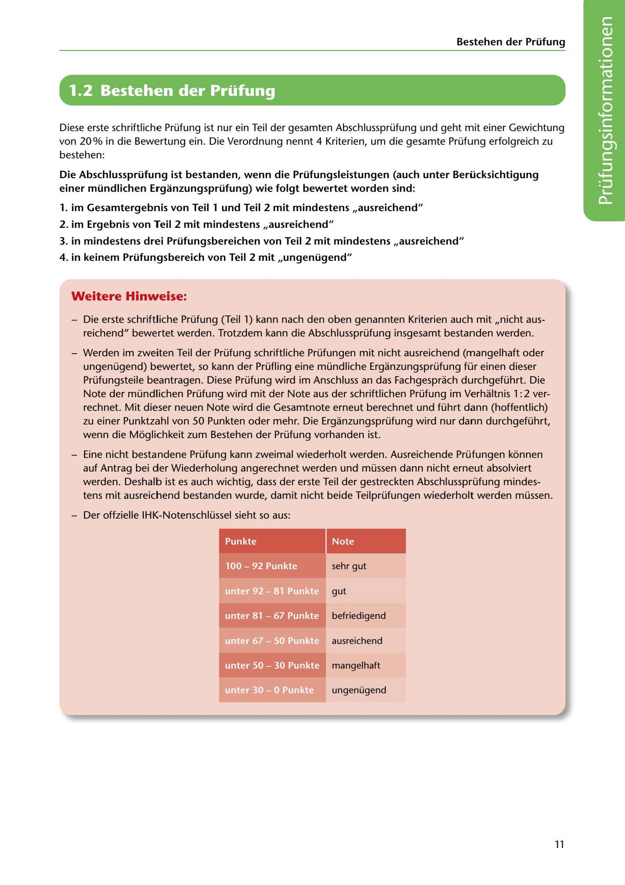

---
## Page 13
---

Bestehen der Prüfung

# 1.2 Bestehen der Prüfung

Diese erste schriftliche Prüfung ist nur ein Teil der gesamten Abschlussprüfung und geht mit einer Gewichtung von 20 % in die Bewertung ein. Die Verordnung nennt 4 Kriterien, um die gesamte Prüfung erfolgreich zu bestehen:

Die Abschlussprüfung ist bestanden, wenn die Prüfungsleistungen (auch unter Berücksichtigung einer mündlichen Erganzungsprüfung) wie folgt bewertet worden sind:

1. im Gesamtergebnis von Teil 1 und Teil 2 mit mindestens ,,ausreichend"

### 2. im Ergebnis von Teil 2 mit mindestens ,,ausreichend"

3. in mindestens drei Prüfungsbereichen von Teil 2 mit mindestens ,,ausreichend"

### 4. in keinem Prüfungsbereich von Teil 2 mit ,,ungenügend"

### Weitere Hinweise:

- Die erste schriftliche Prüfung (Teil 1) kann nach den oben genannten Kriterien auch mit ,,nicht aus- reichend" bewertet werden. Trotzdem kann die Abschlussprüfung insgesamt bestanden werden.

- Werden im zweiten Teil der Prüfung schriftliche Prüfungen mit nicht ausreichend (mangelhaft oder ungenügend) bewertet, so kann der Prüfling eine mündliche Erganzungsprüfung für einen dieser Prüfungsteile beantragen. Diese Prüfung wird im Anschluss an das Fachgesprach durchgeführt. Die Note der mündlichen Prüfung wird mit der Note aus der schriftlichen Prüfung im Verhaltnis 1: 2 ver- rechnet. Mit dieser neuen Note wird die Gesamtnote erneut berechnet und führt dann (hoffentlich) zu einer Punktzahl von 50 Punkten oder mehr. Die Erganzungsprüfung wird nur dann durchgeführt, wenn die Moglichkeit zum Bestehen der Prüfung vorhanden ist.

- Eine nicht bestandene Prüfung kann zweimal wiederholt werden. Ausreichende Prüfungen konnen auf Antrag bei der Wiederholung angerechnet werden und müssen dann nicht erneut absolviert werden. Deshalb ist es auch wichtig, dass der erste Teil der gestreckten Abschlussprüfung mindes- tens mit ausreichend bestanden wurde, damit nicht beide Teilprüfungen wiederholt werden müssen.

- Der offzielle IHK-Notenschlüssel sieht so aus:

Note

sehr gut

gut

befriedigend

ausreichend

mangelhaft

ungenügend

<!-- IMAGE: page-013-img-1.jpeg - TODO: Add description -->

11
