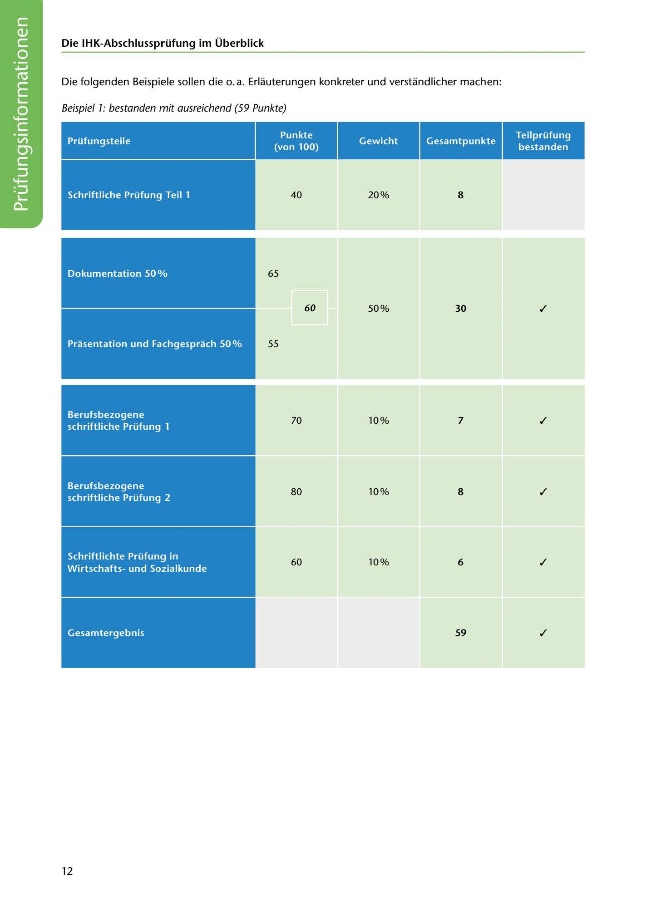

---
## Page 14
---

### Die IHK-Abschlussprüfung im Überblick

Die folgenden Beispiele sollen die o. a. Erlauterungen konkreter und verstandlicher machen:

Beispiel 1: bestanden mit ausreichend (59 Punkte)

Gewicht Gesamtpunkte

### Prüfungsteile

Teilprüfung bestanden

### Punkte

### (von 100)

40

Schriftliche Prüfung Teil 1

### 8

20%

<!-- IMAGE: page-014-img-1.jpeg - TODO: Add description -->

65

Dokumentation 50 %

✓

60

### 30

50%

Prasentation und Fachgesprach 50%

55

✓

70

10% 7

Berufsbezogene schriftliche Prüfung 1

✓

80

### 8

10%

Berufsbezogene schriftliche Prüfung 2

✓

60

10% 6

Schriftlichte Prüfung in Wirtschaftsund Sozialkunde

✓

Gesamtergebnis

### 59

12
