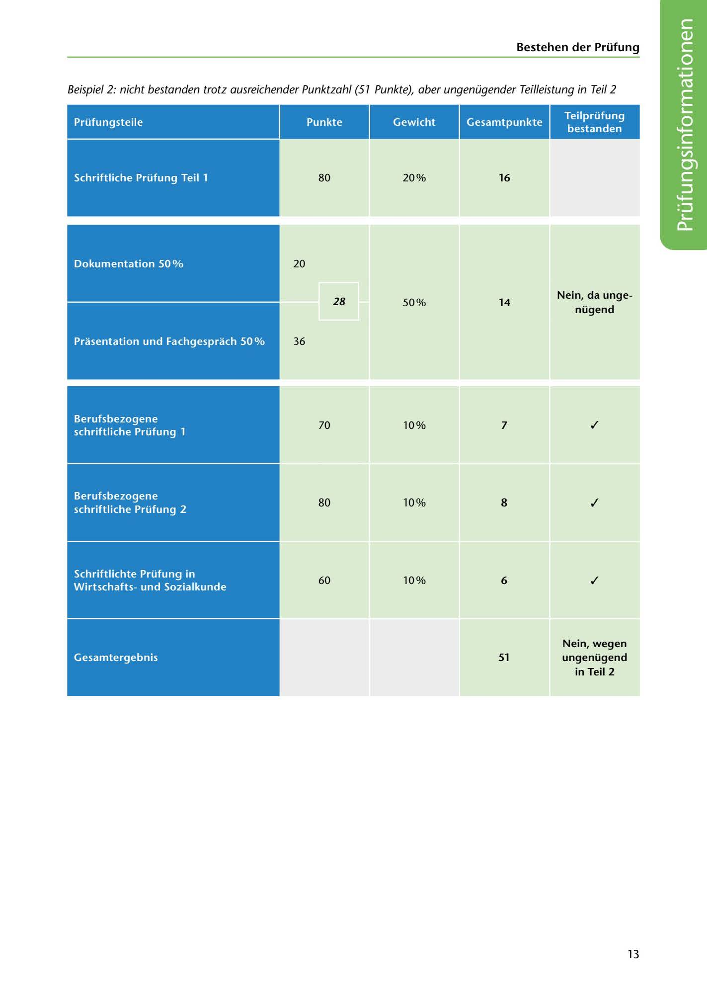

---
## Page 15
---

Bestehen der Prüfung

Beispiel 2: nicht bestanden trotz ausreichender Punktzahl (51 Punkte), aber ungenügender Teilleistung in Teil 2

Prüfungsteile

Punkte

Gewicht Gesamtpunkte

Teilprüfung bestanden

80

Schriftliche Prüfung Teil 1

### 16

20%

Dokumentation 50 %

20

Nein, da unge-

### 28

### 14

50%

nügend

Prasentation und Fachgesprach 50%

36

✓

70

10% 7

Berufsbezogene schriftliche Prüfung 1

✓

80

10% 8

Berufsbezogene schriftliche Prüfung 2

✓

60

10% 6

Schriftlichte Prüfung in Wirtschaftsund Sozialkunde

Gesamtergebnis

### 51

Nein, wegen ungenügend in Teil 2

13

<!-- IMAGE: page-015-img-1.jpeg - TODO: Add description -->
