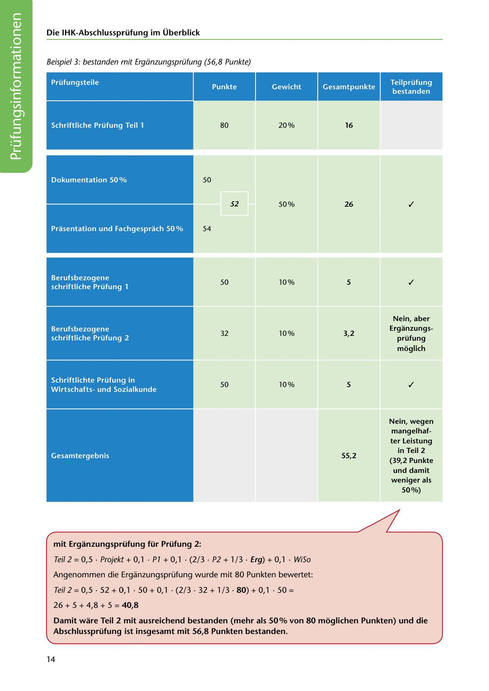

---
## Page 16
---

Die IHK-Abschlussprüfung im Überblick

Beispiel 3: bestanden mit Ergdnzungsprüfung (56,8 Punkte)

Prüfungsteile

Punkte

Gewicht

Gesamtpunkte

Teilprüfung bestanden

80

16

Schriftliche Prüfung Teil 1

20%

<!-- IMAGE: page-016-img-1.jpeg - TODO: Add description -->

50

Dokumentation 50 %

✓

52

50%

26

54

Prasentation und Fachgesprach 50%

✓

10%

5

50

Berufsbezogene schriftliche Prüfung 1

Nein, aber Erganzungs-

10%

3,2

32

Berufsbezogene schriftliche Prüfung 2

prüfung moglich

✓

50

10%

### 5

Schriftlichte Prüfung in Wirtschaftsund Sozialkunde

### 55,2

### Nein, wegen

### mangelhaf-

### ter Leistung

### in Teil 2

### (39,2 Punkte

### und damit

### weniger als

### 50%)

**[VISUAL: EXAM SCORING EXAMPLE 3]**
Scoring table showing a passing scenario with supplementary exam (Ergänzungsprüfung), demonstrating how 56.8 points can be achieved.

**[VISUAL: EXAM SCORING EXAMPLE 3]**
Scoring table showing a passing scenario with supplementary exam (Ergänzungsprüfung), demonstrating how 56.8 points can be achieved.

### mit Erganzungsprüfung für Prüfung 2:

Teil 2 = 0,5 • Projekt + O, 1 • Pl + O, 1 • (2/ 3 • P2 + 1 / 3 • Erg) + O, 1 • WiSo

Angenommen die Erganzungsprüfung wurde mit 80 Punkten bewertet:

## Teil 2 = 0,5 • 52 + O, 1 • 50 + O, 1 • (2/ 3 • 32 + 1 / 3 • 80) + O, 1 • 50 =

### 26 + 5 + 4,8 + 5 = 40,8

Damit ware Teil 2 mit ausreichend bestanden (mehr als 50% von 80 moglichen Punkten) und die Abschlussprüfung ist insgesamt mit 56,8 Punkten bestanden.

14
