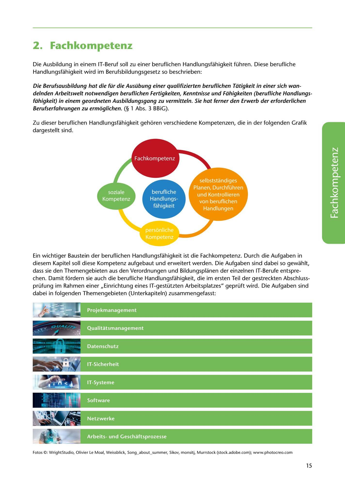

---
## Page 17
---

# 2. Fachkompetenz

Die Ausbildung in einem IT-Beruf soll zu einer beruflichen Handlungsfahigkeit führen. Diese berufliche Handlungsfahigkeit wird im Berufsbildungsgesetz so beschrieben:

### Berufserfahrungen zu ermoglichen. (§ 1 Abs. 3 BBiG).

Die Berufsausbildung hat die für die Ausübung einer qualifizierten beruflichen Tütigkeit in einer sich wan- delnden Arbeitswelt notwendigen beruflichen Fertigkeiten, Kenntnisse und Fühigkeiten (berufliche Handlungs- féihigkeit) in einem geordneten Ausbildungsgang zu vermitteln. Sie hat ferner den Erwerb der erforderlichen

Zu dieser beruflichen Handlungsfahigkeit gehoren verschiedene Kompetenzen, die in der folgenden Grafik dargestellt sind.

<!-- IMAGE: page-017-img-1.jpeg - TODO: Add description -->

**[VISUAL: PROFESSIONAL COMPETENCY MODEL]**
Diagram showing the components of professional competency (berufliche Handlungsfähigkeit) including technical, methodological, social, and personal competencies.

Ein wichtiger Baustein der beruflichen Handlungsfahigkeit ist die Fachkompetenz. Durch die Aufgaben in diesem Kapitel soll diese Kompetenz aufgebaut und erweitert werden. Die Aufgaben sind dabei so gewahlt, dass sie den Themengebieten aus den Verordnungen und Bildungsplanen der einzelnen IT-Berufe entspre- chen. Damit fürdern sie auch die berufliche Handlungsfahigkeit, die im ersten Teil der gestreckten Abschluss- prüfung im Rahmen einer ,,Einrichtung eines IT-gestützten Arbeitsplatzes" geprüft wird. Die Aufgaben sind dabei in folgenden Themengebieten (Unterkapiteln) zusammengefasst:

### .. 111,t'I

' .

_,

**[VISUAL: PROFESSIONAL COMPETENCY MODEL]**
Diagram showing the components of professional competency (berufliche Handlungsfähigkeit) including technical, methodological, social, and personal competencies.

Fotos ©: WrightStudio, Olivier Le Moal, Weissblick, Song_about_summer, Sikov, monsitj, Murrstock (stock.adobe.com); www.photocreo.com

15
