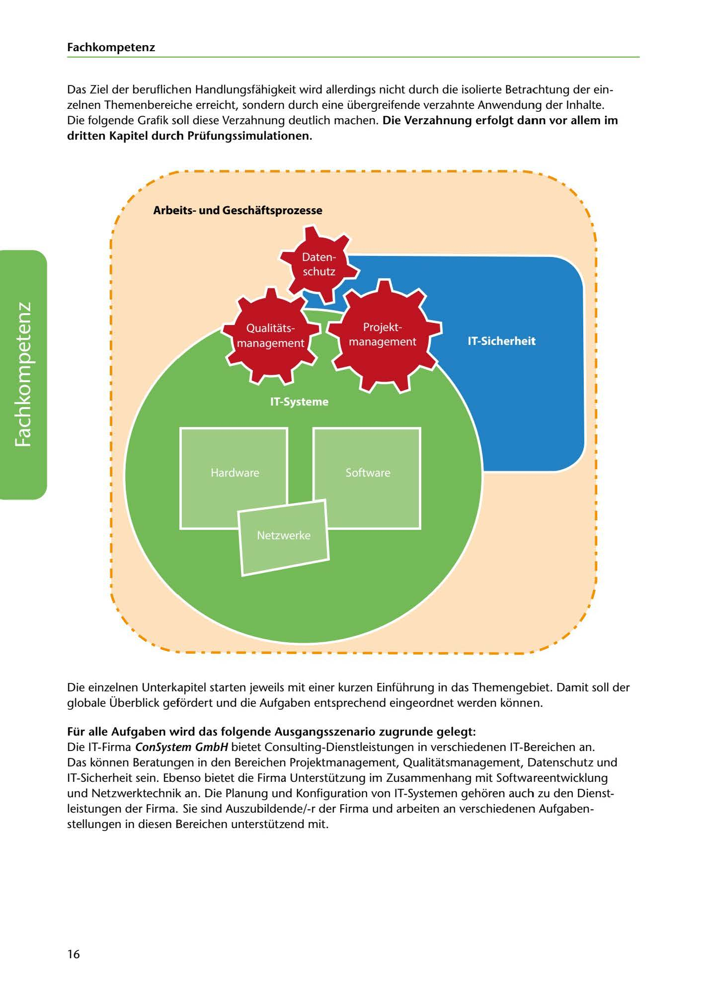

---
## Page 18
---

### Fach kom petenz

Das Ziel der beruflichen Handlungsfahigkeit wird allerdings nicht durch die isolierte Betrachtung der ein- zelnen Themenbereiche erreicht, sondern durch eine übergreifende verzahnte Anwendung der lnhalte.

### dritten Kapitel durch Prüfungssimulationen.

Die folgende Grafik soll diese Verzahnung deutlich machen. Die Verzahnung erfolgt dann vor allem im

# -~------------------·--------~-,

## -

;

### Arbeitsund Geschaftsprozesse

\

\

<!-- IMAGE: page-018-img-1.jpeg - TODO: Add description -->

**[VISUAL: TOPIC INTERCONNECTION DIAGRAM]**
Diagram showing the interconnection (Verzahnung) of different topic areas in IT professional competency. The visual demonstrates how Arbeits- und Geschäftsprozesse (work and business processes), IT-Systeme, and other topic areas connect and overlap, emphasizing that professional competency is achieved through integrated application rather than isolated study of individual topics.

Die einzelnen Unterkapitel starten jeweils mit einer kurzen Einführung in das Themengebiet. Damit soll der globale Überblick gefürdert und die Aufgaben entsprechend eingeordnet werden konnen.

Für alle Aufgaben wird das folgende Ausgangsszenario zugrunde gelegt: Die IT-Firma ConSystem GmbH bietet Consulting-Dienstleistungen in verschiedenen IT-Bereichen an. Das konnen Beratungen in den Bereichen Projektmanagement, Qualitatsmanagement, Datenschutz und IT-Sicherheit sein. Ebenso bietet die Firma Unterstützung im Zusammenhang mit Softwareentwicklung und Netzwerktechnik an. Die Planung und Konfiguration van IT-Systemen gehoren auch zu den Dienst- leistungen der Firma. Sie sind Auszubildende/-r der Firma und arbeiten an verschiedenen Aufgaben- stellungen in diesen Bereichen unterstützend mit.

16
