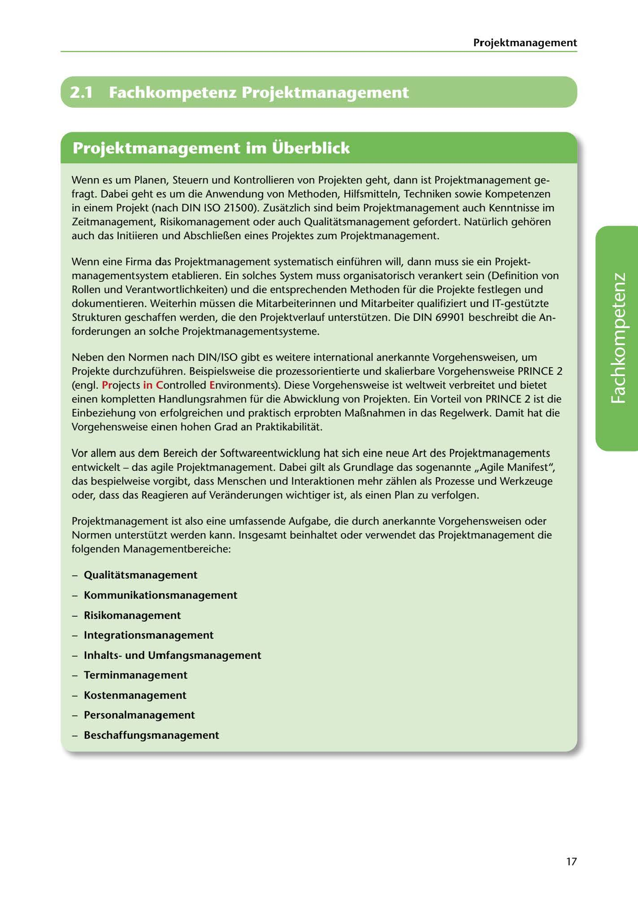

---
## Page 19
---

### Projektmanagement

# 2.1

# Fachkompetenz Projektmanagement

<!-- IMAGE: page-019-img-1.jpeg - TODO: Add description -->

**[VISUAL: PROJECT MANAGEMENT SECTION HEADER]**
Chapter header image for "2.1 Fachkompetenz Projektmanagement" (Professional Competency in Project Management) section, with decorative business/technology graphics.

Wenn es um Planen, Steuern und Kontrollieren von Projekten geht, dann ist Projektmanagement ge- fragt. Dabei geht es um die Anwendung von Methoden, Hilfsmitteln, Techniken sowie Kompetenzen

in einem Projekt (nach DIN ISO 21500). Zusatzlich sind beim Projektmanagement auch Kenntnisse im Zeitmanagement, Risikomanagement oder auch Qualitatsmanagement gefordert. Natürlich gehoren auch das lnitiieren und Abschlieí!.en eines Projektes zum Projektmanagement.

Wenn eine Firma das Projektmanagement systematisch einführen will, dann muss sie ein Projekt-

managementsystem etablieren. Ein solches System muss organisatorisch verankert sein (Definition von Rollen und Verantwortlichkeiten) und die entsprechenden Methoden für die Projekte festlegen und dokumentieren. Weiterhin müssen die Mitarbeiterinnen und Mitarbeiter qualifiziert und IT-gestützte Strukturen geschaffen werden, die den Projektverlauf unterstützen. Die DIN 69901 beschreibt die An- forderungen an solche Projektmanagementsysteme.

Neben den Normen nach DIN/ ISO gibt es weitere international anerkannte Vorgehensweisen, um Projekte durchzuführen. Beispielsweise die prozessorientierte und skalierbare Vorgehensweise PRINCE 2 (engl. Projects in Controlled Environments). Diese Vorgehensweise ist weltweit verbreitet und bietet einen kompletten Handlungsrahmen für die Abwicklung von Projekten. Ein Vorteil von PRINCE 2 ist die Einbeziehung von erfolgreichen und praktisch erprobten Maí!.nahmen in das Regelwerk. Damit hat die Vorgehensweise einen hohen Grad an Praktikabilitat.

**[VISUAL: PROJECT MANAGEMENT AREAS DIAGRAM]**
Visual representation showing the various management areas that comprise project management, including quality management, communication management, risk management, integration management, content/scope management, time management, cost management, personnel management, and procurement management.

Vor allem aus dem Bereich der Softwareentwicklung hat sich eine neue Art des Projektmanagements entwickelt - das agile Projektmanagement. Dabei gilt als Grundlage das sogenannte ,,Agile Manifest", das bespielweise vorgibt, dass Menschen und lnteraktionen mehr zahlen als Prozesse und Werkzeuge oder, dass das Reagieren auf Veranderungen wichtiger ist, als einen Plan zu verfolgen.

Projektmanagement ist also eine umfassende Aufgabe, die durch anerkannte Vorgehensweisen oder Normen unterstützt werden kann. lnsgesamt beinhaltet oder verwendet das Projektmanagement die folgenden Managementbereiche:

### Qualitatsmanagement

-

### Kommunikationsmanagement

-

### Risikomanagement

-

### lntegrationsmanagement

-

### lnhaltsund Umfangsmanagement

-

### Terminmanagement

-

### Kostenmanagement

-

### Personalmanagement

-

### Beschaffungsmanagement

-

17
