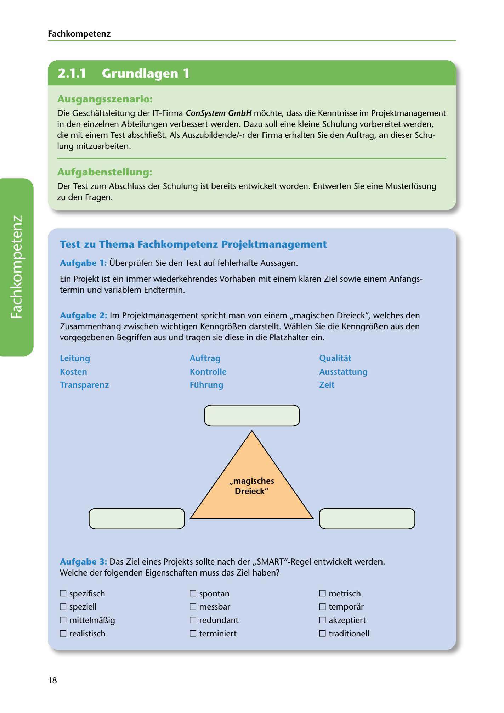

---
## Page 20
---

Fach kom petenz




<!-- IMAGE: page-020-img-1.jpeg - TODO: Add description -->

**[VISUAL: CONSYSTEM GMBH SCENARIO HEADER]**
Header image for the ConSystem GmbH training scenario about project management competencies.

### Ausgangsszenario:

Die Geschaftsleitung der IT-Firma ConSystem GmbH mi::ichte, dass die Kenntnisse im Projektmanagement in den einzelnen Abteilungen verbessert werden. Dazu soll eine kleine Schulung vorbereitet werden, die mit einem Test abschlieí!.t. Als Auszubildende/-r der Firma erhalten Sie den Auftrag, an dieser Schu- lung mitzuarbeiten.


### Aufgabenstellung:

Der Test zum Abschluss der Schulung ist bereits entwickelt worden. Entwerfen Sie eine Musterli::isung zu den Fragen.


### Test zu Thema Fachkompetenz Projektmanagement

Aufgabe 1: Überprüfen Sie den Text auf fehlerhafte Aussagen.

Ein Projekt ist ein immer wiederkehrendes Vorhaben mit einem klaren Ziel sowie einem Anfangs- termin und variablem Endtermin.

Aufgabe 2: lm Projektmanagement spricht man von einem ,,magischen Dreieck", welches den Zusammenhang zwischen wichtigen Kenngri::ií!.en darstellt. Wahlen Sie die Kenngri::ií!.en aus den vorgegebenen Begriffen aus und tragen sie diese in die Platzhalter ein.


**[VISUAL: MAGIC TRIANGLE OF PROJECT MANAGEMENT - EXERCISE]**
An interactive exercise diagram showing the "magic triangle" (magisches Dreieck) of project management with empty placeholders for students to fill in. The triangle has three vertices to be completed with the correct terms from the word bank:
- Word bank provided: Leitung, Auftrag, Qualität, Kosten, Kontrolle, Ausstattung, Transparenz, Führung, Zeit
- Correct answers: Qualität (Quality), Kosten (Cost), Zeit (Time)

```
           ( Qualität )
              /\
             /  \
            /    \
           /      \
          /________\
   ( Kosten )    ( Zeit )
```
The magic triangle illustrates the interdependency of these three key project constraints.

Aufgabe 3: Das Ziel eines Projekts sollte nach der ,,SMART"-Regel entwickelt werden. Welche der folgenden Eigenschaften muss das Ziel haben?

□ spezifisch □ spontan □ metrisch

□ speziell □ messbar □ temporar

□ mittelmaí!.ig □ redundant □ akzeptiert

□ realistisch □ terminiert □ traditionell

18
