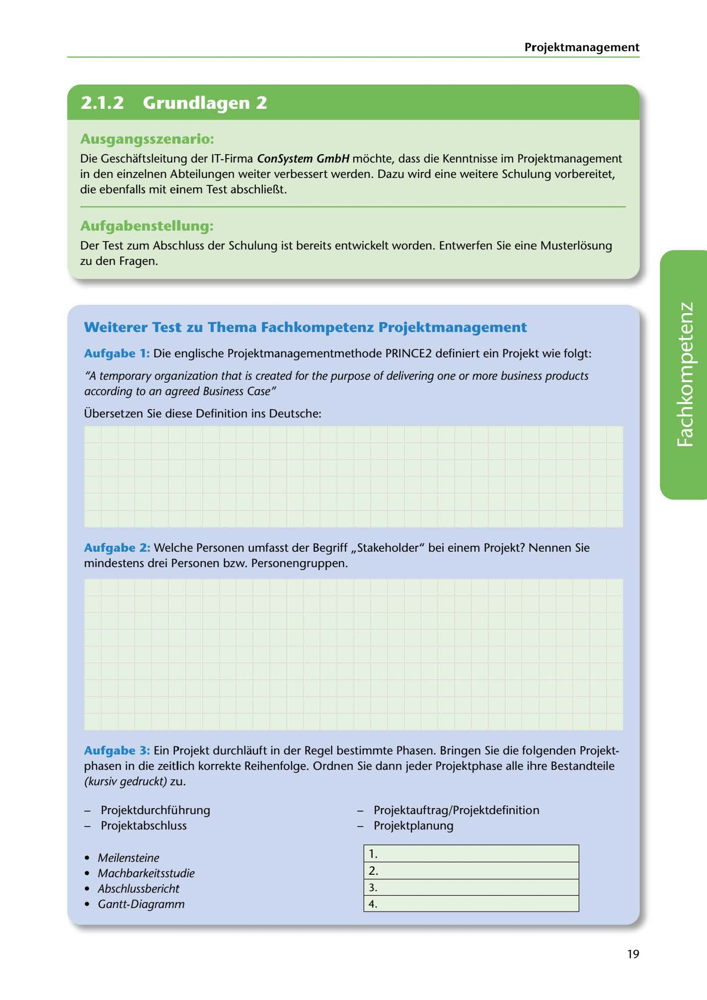

---
## Page 21
---

### Projektmanagement

<!-- IMAGE: page-021-img-1.jpeg - TODO: Add description -->

**[VISUAL: CONSYSTEM GMBH SCENARIO HEADER]**
Header image for the continued ConSystem GmbH training scenario on project management knowledge improvement.

### Ausgangsszenario:

Die Geschaftsleitung der IT-Firma ConSystem GmbH mochte, dass die Kenntnisse im Projektmanagement in den einzelnen Abteilungen weiter verbessert werden. Dazu wird eine weitere Schulung vorbereitet, die ebenfalls mit einem Test abschliel1t.

### Aufgabenstellung:

Der Test zum Abschluss der Schulung ist bereits entwickelt worden. Entwerfen Sie eine Musterlosung zu den Fragen.

### Weiterer Test zu Thema Fachkompetenz Projektmanagement

Aufgabe 1: Die englische Projektmanagementmethode PRINCE2 definiert ein Projekt wie folgt:

''A temporary organization that is created far the purpose of de/ivering one or more business products according to an agreed Business Case"

Übersetzen Sie diese Definition ins Deutsche:

**[VISUAL: ANSWER SPACE]**
Blank lined area for students to write their German translation of the PRINCE2 project definition.

Aufgabe 2: Welche Personen umfasst der Begriff ,,Stakeholder" bei einem Projekt? Nennen Sie mindestens drei Personen bzw. Personengruppen.

Aufgabe 3: Ein Projekt durchlauft in der Regel bestimmte Phasen. Bringen Sie die folgenden Projekt- phasen in die zeitlich korrekte Reihenfolge. Ordnen Sie dann jeder Projektphase alle ihre Bestandteile (kursiv gedruckt) zu.

- Projektdurchfü hrung - Projektauftrag/Projektdefinition - Projektabschluss - Projektplanung

# li

• Meilensteine • Machbarkeitsstudie • Abschlussbericht • Gantt-Diagramm

19
