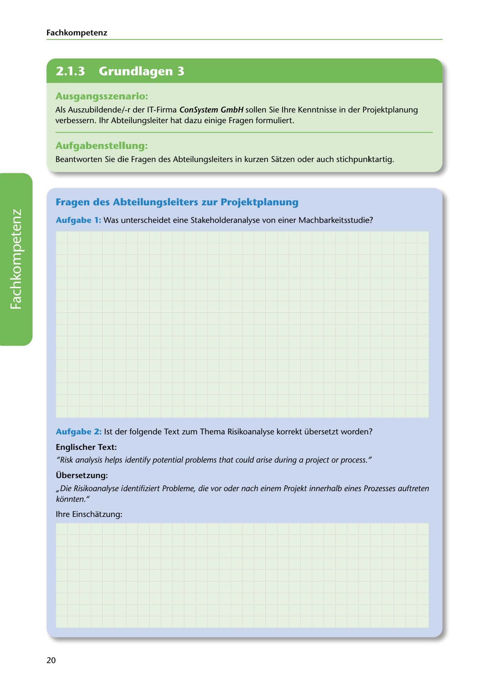

---
## Page 22
---

Fach kom petenz

<!-- IMAGE: page-022-img-1.jpeg - TODO: Add description -->

**[VISUAL: CONSYSTEM GMBH SCENARIO HEADER]**
Header image for the ConSystem GmbH project planning knowledge assessment scenario.

## Ausgangsszenario:

Als Auszubildende/-r der IT-Firma ConSystem GmbH sallen Sie lhre Kenntnisse in der Projektplanung verbessern. 1hr Abteilungsleiter hat dazu einige Fragen formuliert.

## Aufgabenstellung:

Beantworten Sie die Fragen des Abteilungsleiters in kurzen Satzen oder auch stichpunktartig.

## Fragen des Abteilungsleiters zur Projektplanung

Aufgabe 1: Was unterscheidet eine Stakeholderanalyse von einer Machbarkeitsstudie?

**[VISUAL: ANSWER SPACE]**
Blank lined area for students to explain the difference between stakeholder analysis and feasibility study.

Aufgabe 2: 1st der folgende Text zum Thema Risikoanalyse korrekt übersetzt worden?

### Englischer Text:

11Risk analysis helps identify poten tia/ problems that could arise during a project or process. 11

### Übersetzung:

11

11Die Risikoanalyse identifiziert Probleme, die vor oder nach einem Projekt innerhalb eines Prozesses auftreten kéinnten.

lhre Einschatzung:

20
