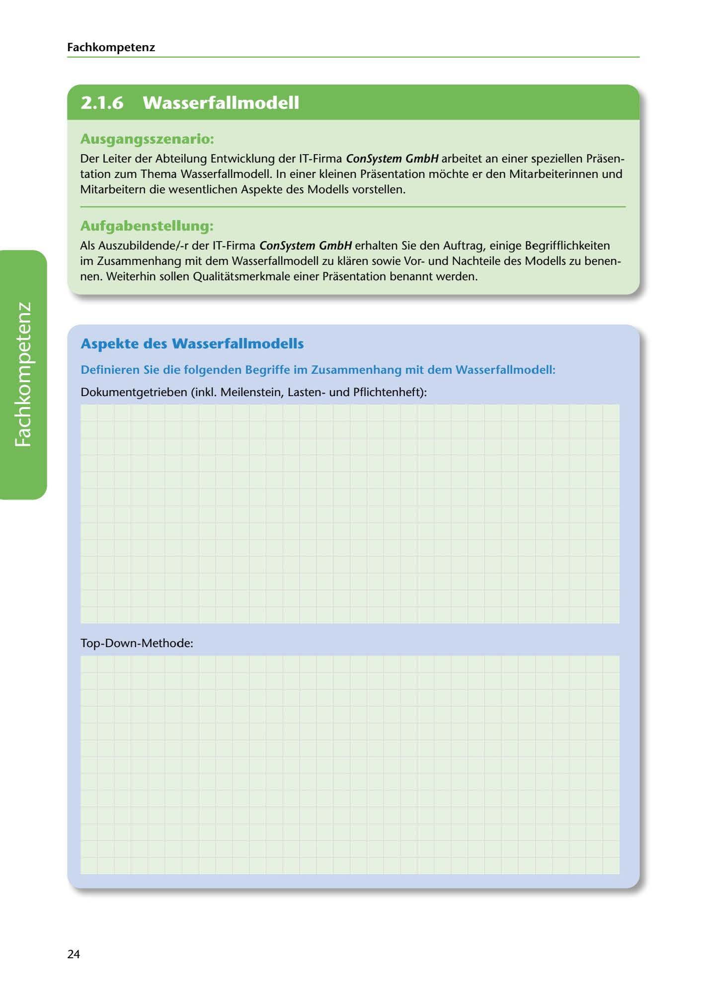

---
## Page 26
---

Fach kom petenz

<!-- IMAGE: page-026-img-1.jpeg - TODO: Add description -->

**[VISUAL: CONSYSTEM GMBH SCENARIO HEADER]**
Header image for the ConSystem GmbH waterfall model presentation scenario.

## Ausgangsszenario:

Der Leiter der Abteilung Entwicklung der IT-Firma ConSystem GmbH arbeitet an einer speziellen Prasen- tation zum Thema Wasserfallmodell. In einer kleinen Prasentation mochte er den Mitarbeiterinnen und Mitarbeitern die wesentlichen Aspekte des Modells vorstellen.

## Aufgabenstellung:

Als Auszubildende/-r der IT-Firma ConSystem GmbH erhalten Sie den Auftrag, einige Begrifflichkeiten im Zusammenhang mit dem Wasserfallmodell zu klaren sowie Vorund Nachteile des Modells zu benen- nen. Weiterhin sollen Qualitatsmerkmale einer Prasentation benannt werden.

## Aspekte des Wasserfallmodells

Definieren Sie die folgenden Begriffe im Zusammenhang mit dem Wasserfallmodell:

Dokumentgetrieben (inkl. Meilenstein, Lastenund Pflichtenheft):

**[VISUAL: ANSWER SPACE]**
Blank lined area for students to define "document-driven" concepts including milestones, requirements specification (Lastenheft), and functional specification (Pflichtenheft).

Top-Down-Methode:

24
