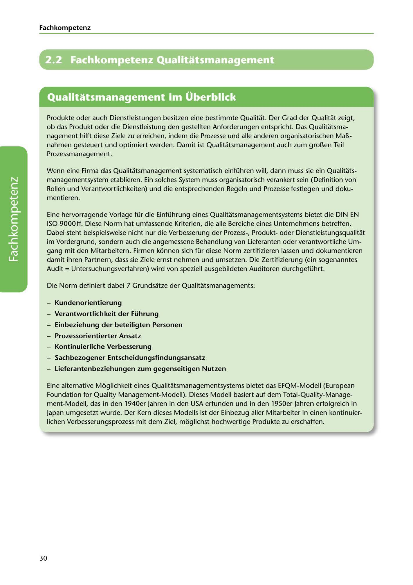

---
## Page 32
---

Fach kom petenz

# 2.2 Fachkompetenz Qualitatsmanagement

<!-- IMAGE: page-032-img-1.jpeg - TODO: Add description -->

**[VISUAL: QUALITY MANAGEMENT SECTION HEADER]**
Chapter header image for "2.2 Fachkompetenz Qualitätsmanagement" (Professional Competency in Quality Management) section, with business/technology graphics representing quality processes.

Produkte oder auch Dienstleistungen besitzen eine bestimmte Qualitat. Der Grad der Qualitat zeigt, ob das Produkt oder die Dienstleistung den gestellten Anforderungen entspricht. Das Qualitatsma- nagement hilft diese Ziele zu erreichen, indem die Prozesse und alle anderen organisatorischen Maí!i- nahmen gesteuert und optimiert werden. Damit ist Qualitatsmanagement auch zum groí!ien Teil Prozessmanagement.

Wenn eine Firma das Qualitatsmanagement systematisch einführen will, dann muss sie ein Qualitats- managementsystem etablieren. Ein solches System muss organisatorisch verankert sein (Definition von Rollen und Verantwortlichkeiten) und die entsprechenden Regeln und Prozesse festlegen und doku- mentieren.

Eine hervorragende Vorlage für die Einführung eines Qualitatsmanagementsystems bietet die DIN EN ISO 9000ft. Diese Norm hat umfassende Kriterien, die alle Bereiche eines Unternehmens betreffen. Dabei steht beispielsweise nicht nur die Verbesserung der Prozess-, Produktoder Dienstleistungsqualitat im Vordergrund, sondern auch die angemessene Behandlung von Lieferanten oder verantwortliche Um- gang mit den Mitarbeitern. Firmen ki::innen sich für diese Norm zertifizieren lassen und dokumentieren damit ihren Partnern, dass sie Ziele ernst nehmen und umsetzen. Die Zertifizierung (ein sogenanntes Audit = Untersuchungsverfahren) wird von speziell ausgebildeten Auditaren durchgeführt.

Die Norm definiert dabei 7 Grundsatze der Qualitatsmanagements:

**[VISUAL: SEVEN PRINCIPLES OF QUALITY MANAGEMENT]**
Diagram showing the 7 fundamental principles of quality management according to DIN EN ISO 9000:
1. Kundenorientierung (Customer focus)
2. Verantwortlichkeit der Führung (Leadership responsibility)
3. Einbeziehung der beteiligten Personen (Engagement of people)
4. Prozessorientierter Ansatz (Process approach)
5. Kontinuierliche Verbesserung (Continuous improvement)
6. Sachbezogener Entscheidungsfindungsansatz (Evidence-based decision making)
7. Lieferantenbeziehungen zum gegenseitigen Nutzen (Relationship management)

### Kundenorientierung

-

### Verantwortlichkeit der Führung

-

### Einbeziehung der beteiligten Personen

-

### Prozessorientierter Ansatz

-

### Kontinuierliche Verbesserung

-

### Sachbezogener Entscheidungsfindungsansatz

-

### Lieferantenbez.iehungen zum gegenseitigen Nutzen

-

Eine alternative Moglichkeit eines Qualitatsmanagementsystems bietet das EFQM-Modell (European Foundation for Quality Management-Modell). Dieses Modell basiert auf dem Total-Quality-Manage- ment-Modell, das in den 1940er Jahren in den USA erfunden und in den 1950er Jahren erfolgreich in Japan umgesetzt wurde. Der Kern dieses Modells ist der Einbezug aller Mitarbeiter in einen kontinuier- lichen Verbesserungsprozess mit dem Ziel, mi::iglichst hochwertige Produkte zu erschaffen.

30
