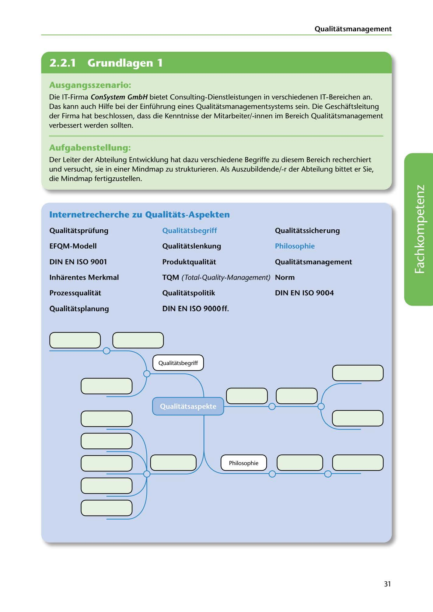

---
## Page 33
---

### Qualitatsmanagement

<!-- IMAGE: page-033-img-1.jpeg - TODO: Add description -->

**[VISUAL: CONSYSTEM GMBH SCENARIO HEADER]**
Header image for the ConSystem GmbH quality management consulting scenario.

## Ausgangsszenario:

Die IT-Firma ConSystem GmbH bietet Consulting-Dienstleistungen in verschiedenen IT-Bereichen an. Das kann auch Hilfe bei der Einführung eines Qualitatsmanagementsystems sein. Die Geschaftsleitung der Firma hat beschlossen, dass die Kenntnisse der Mitarbeiter/-innen im Bereich Qualitatsmanagement verbessert werden sollten.

## Aufgabenstellung:

Der Leiter der Abteilung Entwicklung hat dazu verschiedene Begriffe zu diesem Bereich recherchiert und versucht, sie in einer Mindmap zu strukturieren. Als Auszubildende/-r der Abteilung bittet er Sie, die Mindmap fertigzustellen.

## lnternetrecherche zu Qualitats-Aspekten

### Qualitatsprüfung

### Qualitatsbegriff

### Qualitatssicherung

### EFQM-Modell

### Qualitatslenkung

### Philosophie

### DIN EN ISO 9001

### Produktqualitat

### Qualitatsmanagement

### lnharentes Merkmal

### TQM (Total-Quality-Management) Norm

### Prozessqualitat

### Qualitatspolitik

### DIN EN ISO 9004

**[VISUAL: QUALITY MANAGEMENT MINDMAP - EXERCISE]**
An incomplete mindmap exercise for students to organize quality management concepts. The mindmap should connect terms like Qualitätsprüfung, Qualitatssicherung, EFQM-Modell, DIN EN ISO 9000ff., TQM, Produktqualität, Prozessqualität, and other quality-related concepts in a logical structure with "Qualitätsbegriff" and "Philosophie" as central nodes.

### DIN EN ISO 9000ff .

### Qualitatsplanung

# =====--l) ~( ::::::::::----)

.::::= (

Qualitatsbegriff

# _(_....:::::::::=-_)

# (~----====::...--)

# )

**[VISUAL: QUALITY MANAGEMENT MINDMAP - EXERCISE]**
An incomplete mindmap exercise for students to organize quality management concepts. The mindmap should connect terms like Qualitätsprüfung, Qualitatssicherung, EFQM-Modell, DIN EN ISO 9000ff., TQM, Produktqualität, Prozessqualität, and other quality-related concepts in a logical structure with "Qualitätsbegriff" and "Philosophie" as central nodes.

# (==-==-==-~)

# (==-==-=-S)

# ( __ ------===::::::::.)---1 ~( ====::::;:;')

# Philosophie J (

# ) (

# )

# • \-2=" ====~ ~

# ====----

( •

# (==-==-==----2")

# (_----====:::::,....,)

31
