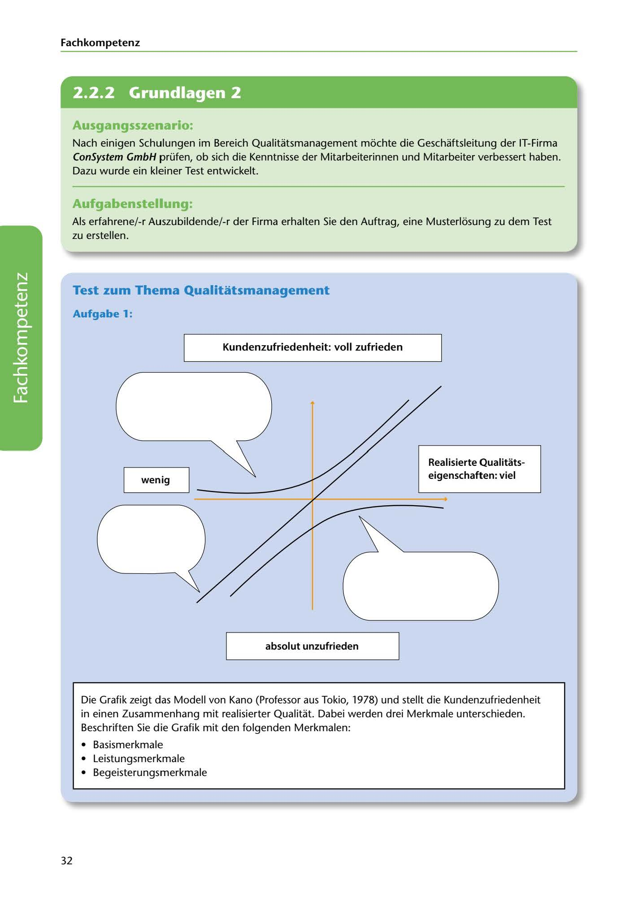

---
## Page 34
---

Fach kom petenz

<!-- IMAGE: page-034-img-1.jpeg - TODO: Add description -->

**[VISUAL: CONSYSTEM GMBH SCENARIO HEADER]**
Header image for the ConSystem GmbH quality management test scenario.

## Ausgangsszenario:

Nach einigen Schulungen im Bereich Qualitatsmanagement mochte die Geschaftsleitung der IT-Firma ConSystem GmbH prüfen, ob sich die Kenntnisse der Mitarbeiterinnen und Mitarbeiter verbessert haben. Dazu wurde ein kleiner Test entwickelt.

## Aufgabenstellung:

Als erfahrene/-r Auszubildende/-r der Firma erhalten Sie den Auftrag, eine Musterlosung zu dem Test zu erstellen.

## Test zum Thema Qualitatsmanagement

### Aufgabe 1:

### Kundenzufriedenheit: voll zufrieden

### t

**[VISUAL: KANO MODEL DIAGRAM - EXERCISE]**
The Kano model diagram (developed by Professor Noriaki Kano, Tokyo, 1978) showing the relationship between customer satisfaction and realized quality characteristics. The diagram has:
- Y-axis: Kundenzufriedenheit (Customer satisfaction) ranging from "absolut unzufrieden" (absolutely dissatisfied) to "voll zufrieden" (fully satisfied)
- X-axis: Realisierte Qualitätseigenschaften (Realized quality features) ranging from "wenig" (little) to "viel" (much)
- Three curves to be labeled: Basismerkmale (basic features), Leistungsmerkmale (performance features), Begeisterungsmerkmale (excitement features)

### Realisierte Qualitats-

### eigenschaften: viel

### wenig

**[VISUAL: KANO MODEL DIAGRAM - EXERCISE]**
The Kano model diagram (developed by Professor Noriaki Kano, Tokyo, 1978) showing the relationship between customer satisfaction and realized quality characteristics. The diagram has:
- Y-axis: Kundenzufriedenheit (Customer satisfaction) ranging from "absolut unzufrieden" (absolutely dissatisfied) to "voll zufrieden" (fully satisfied)
- X-axis: Realisierte Qualitätseigenschaften (Realized quality features) ranging from "wenig" (little) to "viel" (much)
- Three curves to be labeled: Basismerkmale (basic features), Leistungsmerkmale (performance features), Begeisterungsmerkmale (excitement features)

### absolut unzufrieden

Die Grafik zeigt das Modell von Kano (Professor aus Tokio, 1978) und stellt die Kundenzufriedenheit in einen Zusammenhang mit realisierter Qualitat. Dabei werden drei Merkmale unterschieden. Beschriften Sie die Grafik mit den folgenden Merkmalen:

• Basismerkmale • Leistungsmerkmale • Begeisterungsmerkmale

32
