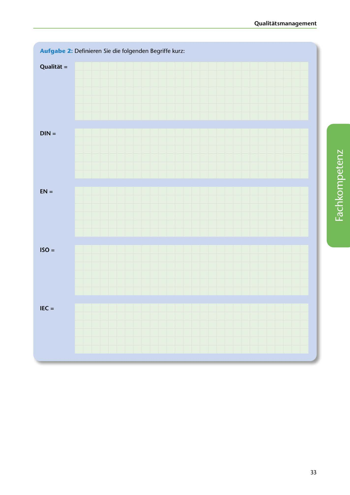

---
## Page 35
---

Qualitatsmanagement

### Aufgabe 2: Definieren Sie die folgenden Begriffe kurz:

Qualitat =

DIN =

EN =

<!-- IMAGE: page-035-img-1.jpeg - TODO: Add description -->

**[VISUAL: ANSWER SPACES]**
Blank lined areas for students to define quality-related abbreviations: Qualität, DIN, EN, ISO, and IEC.

ISO =

IEC =

33
