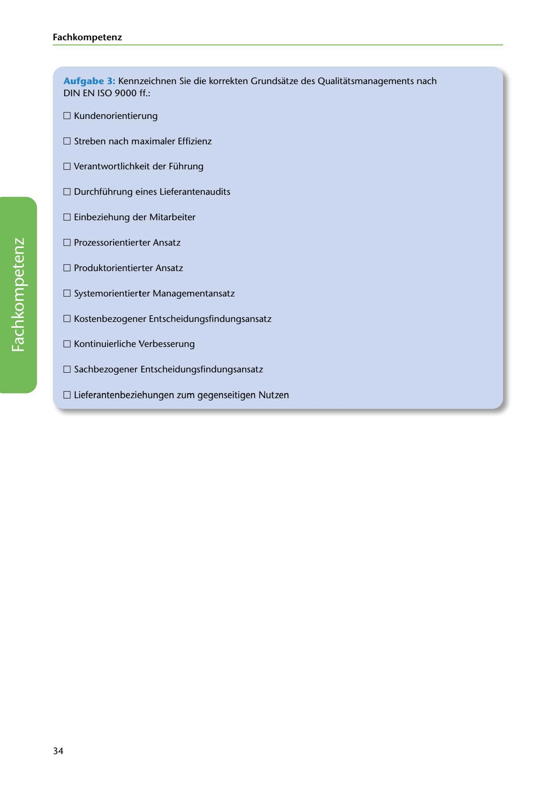

---
## Page 36
---

Fach kom petenz

Aufgabe 3: Kennzeichnen Sie die korrekten Grundsatze des Qualitatsmanagements nach DIN EN ISO 9000 ff.:

O Kundenorientierung

O Streben nach maximaler Effizienz

O Verantwortlichkeit der Führung

O Durchführung eines Lieferantenaudits

O Einbeziehung der Mitarbeiter

O Prozessorientierter Ansatz

O Produktorientierter Ansatz

O Systemorientierter Managementansatz

O Kostenbezogener Entscheidungsfindungsansatz

O Kontinuierliche Verbesserung

O Sachbezogener Entscheidungsfindungsansatz

<!-- IMAGE: page-036-img-1.jpeg - TODO: Add description -->

**[VISUAL: MULTIPLE CHOICE CHECKBOXES]**
Multiple choice exercise with checkboxes for students to identify the correct 7 principles of quality management according to DIN EN ISO 9000ff. from a list that includes both correct and incorrect options.

O Lieferantenbeziehungen zum gegenseitigen Nutzen

34
