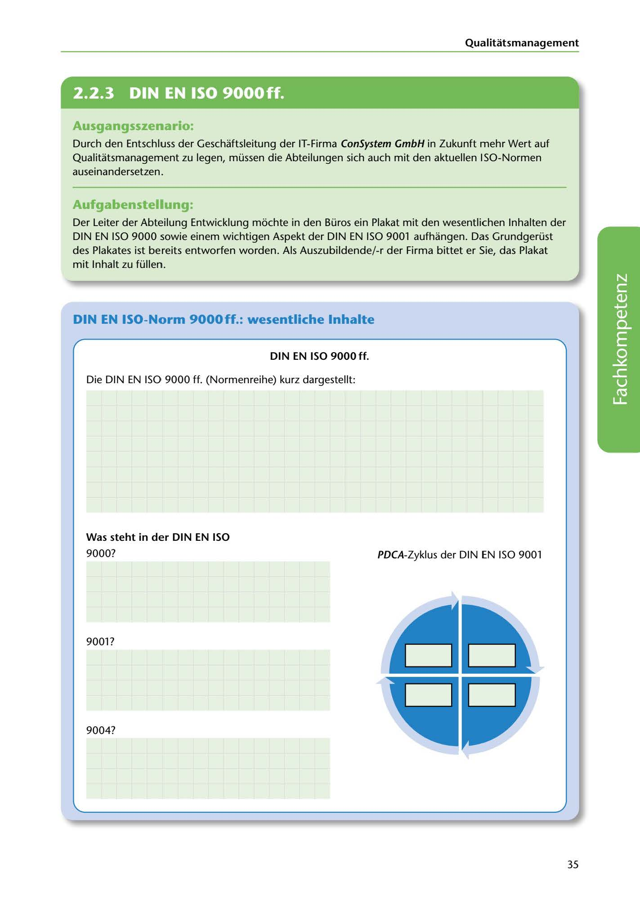

---
## Page 37
---

Qualitatsmanagement

<!-- IMAGE: page-037-img-1.jpeg - TODO: Add description -->

**[VISUAL: CONSYSTEM GMBH SCENARIO HEADER]**
Header image for the ConSystem GmbH ISO standards poster exercise scenario.

### Ausgangsszenario:

Durch den Entschluss der Geschaftsleitung der IT-Firma ConSystem GmbH in Zukunft mehr Wert auf Qualitatsmanagement zu legen, müssen die Abteilungen sich auch mit den aktuellen ISO-Normen auseinandersetzen.

### Aufgabenstellung:

Der Leiter der Abteilung Entwicklung mochte in den Büros ein Plakat mit den wesentlichen lnhalten der DIN EN ISO 9000 sowie einem wichtigen Aspekt der DIN EN ISO 9001 aufhangen. Das Grundgerüst des Plakates ist bereits entworfen worden. Als Auszubildende/-r der Firma bittet er Sie, das Plakat mit lnhalt zu füllen.

## DIN EN ISO-Norm 9000ff.: wesentliche lnhalte

### DIN EN ISO 9000ft.

Die DIN EN ISO 9000 ff. (Normenreihe) kurz dargestellt:

**[VISUAL: DIN EN ISO 9000ff POSTER TEMPLATE]**
A blank poster template for students to fill in key contents of the ISO 9000 series:
- DIN EN ISO 9000: (Definitions and fundamentals)
- DIN EN ISO 9001: (Requirements for QMS)
- DIN EN ISO 9004: (Guidelines for improving performance)
Also includes a PDCA-Zyklus (Plan-Do-Check-Act cycle) diagram template for DIN EN ISO 9001.

### Was steht in der DIN EN ISO

9000?

PDCA-Zyklus der DIN EN ISO 9001

9001?

9004?

**[VISUAL: DIN EN ISO 9000ff POSTER TEMPLATE]**
A blank poster template for students to fill in key contents of the ISO 9000 series:
- DIN EN ISO 9000: (Definitions and fundamentals)
- DIN EN ISO 9001: (Requirements for QMS)
- DIN EN ISO 9004: (Guidelines for improving performance)
Also includes a PDCA-Zyklus (Plan-Do-Check-Act cycle) diagram template for DIN EN ISO 9001.

35
