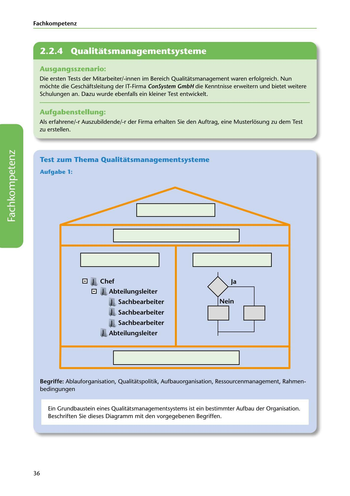

---
## Page 38
---

Fach kom petenz

<!-- IMAGE: page-038-img-1.jpeg - TODO: Add description -->

**[VISUAL: CONSYSTEM GMBH SCENARIO HEADER]**
Header image for the ConSystem GmbH quality management systems test scenario.

## Ausgangsszenario:

Die ersten Tests der Mitarbeiter/-innen im Bereich Qualitatsmanagement waren erfolgreich. Nun mochte die Geschaftsleitung der IT-Firma ConSystem GmbH die Kenntnisse erweitern und bietet weitere Schulungen an. Dazu wurde ebenfalls ein kleiner Test entwickelt.

## Aufgabenstellung:

Als erfahrene/-r Auszubildende/-r der Firma erhalten Sie den Auftrag, eine Musterlosung zu dem Test zu erstellen.

## Test zum Thema Qualitatsmanagementsysteme

### Aufgabe 1:

**[VISUAL: QMS ORGANIZATIONAL STRUCTURE DIAGRAM - EXERCISE]**
An organizational structure diagram for a Quality Management System showing hierarchical levels: Chef (Executive) at top, Abteilungsleiter (Department Managers) below, and Sachbearbeiter (Staff/Clerks) at the bottom. Students must label the diagram components with the provided terms: Ablauforganisation, Qualitätspolitik, Aufbauorganisation, Ressourcenmanagement, Rahmenbedingungen.

**[VISUAL: QMS ORGANIZATIONAL STRUCTURE DIAGRAM - EXERCISE]**
An organizational structure diagram for a Quality Management System showing hierarchical levels: Chef (Executive) at top, Abteilungsleiter (Department Managers) below, and Sachbearbeiter (Staff/Clerks) at the bottom. Students must label the diagram components with the provided terms: Ablauforganisation, Qualitätspolitik, Aufbauorganisation, Ressourcenmanagement, Rahmenbedingungen.

**[VISUAL: QMS ORGANIZATIONAL STRUCTURE DIAGRAM - EXERCISE]**
An organizational structure diagram for a Quality Management System showing hierarchical levels: Chef (Executive) at top, Abteilungsleiter (Department Managers) below, and Sachbearbeiter (Staff/Clerks) at the bottom. Students must label the diagram components with the provided terms: Ablauforganisation, Qualitätspolitik, Aufbauorganisation, Ressourcenmanagement, Rahmenbedingungen.

**[VISUAL: QMS ORGANIZATIONAL STRUCTURE DIAGRAM - EXERCISE]**
An organizational structure diagram for a Quality Management System showing hierarchical levels: Chef (Executive) at top, Abteilungsleiter (Department Managers) below, and Sachbearbeiter (Staff/Clerks) at the bottom. Students must label the diagram components with the provided terms: Ablauforganisation, Qualitätspolitik, Aufbauorganisation, Ressourcenmanagement, Rahmenbedingungen.

### Ja

### Chef

### Abteilungsleiter

El El

### Sachbearbeiter

### Sachbearbeiter

### Sachbearbeiter

**[VISUAL: QMS ORGANIZATIONAL STRUCTURE DIAGRAM - EXERCISE]**
An organizational structure diagram for a Quality Management System showing hierarchical levels: Chef (Executive) at top, Abteilungsleiter (Department Managers) below, and Sachbearbeiter (Staff/Clerks) at the bottom. Students must label the diagram components with the provided terms: Ablauforganisation, Qualitätspolitik, Aufbauorganisation, Ressourcenmanagement, Rahmenbedingungen.

### Abteilungsleiter

Begriffe: Ablauforganisation, Qualitatspolitik, Aufbauorganisation, Ressourcenmanagement, Rahmen- bedingungen

Ein Grundbaustein eines Qualitatsmanagementsystems ist ein bestimmter Aufbau der Organisation. Beschriften Sie dieses Diagramm mit den vorgegebenen Begriffen.

36
