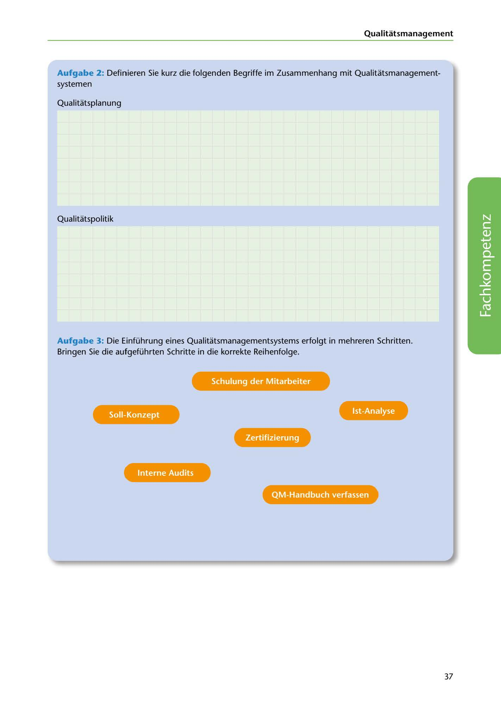

---
## Page 39
---

Qualitatsmanagement

Aufgabe 2: Definieren Sie kurz die folgenden Begriffe im Zusammenhang mit Qualitatsmanagement- systemen

Qualitatsplanung

Qualitatspolitik

<!-- IMAGE: page-039-img-1.jpeg - TODO: Add description -->

**[VISUAL: ANSWER SPACES]**
Blank lined areas for students to define Qualitätsplanung and Qualitätspolitik.

Aufgabe 3: Die Einführung eines Qualitatsmanagementsystems erfolgt in mehreren Schritten. Bringen Sie die aufgeführten Schritte in die korrekte Reihenfolge.

Schulung der Mitarbeiter

lst-Analyse

**[VISUAL: QMS IMPLEMENTATION STEPS - ORDERING EXERCISE]**
A sequence diagram exercise where students must arrange the QMS implementation steps in correct order: Schulung der Mitarbeiter, Ist-Analyse, Zertifizierung, Interne Audits, QM-Handbuch verfassen.

Zertifizierung

Interne Audits

QM-Handbuch verfassen

37
