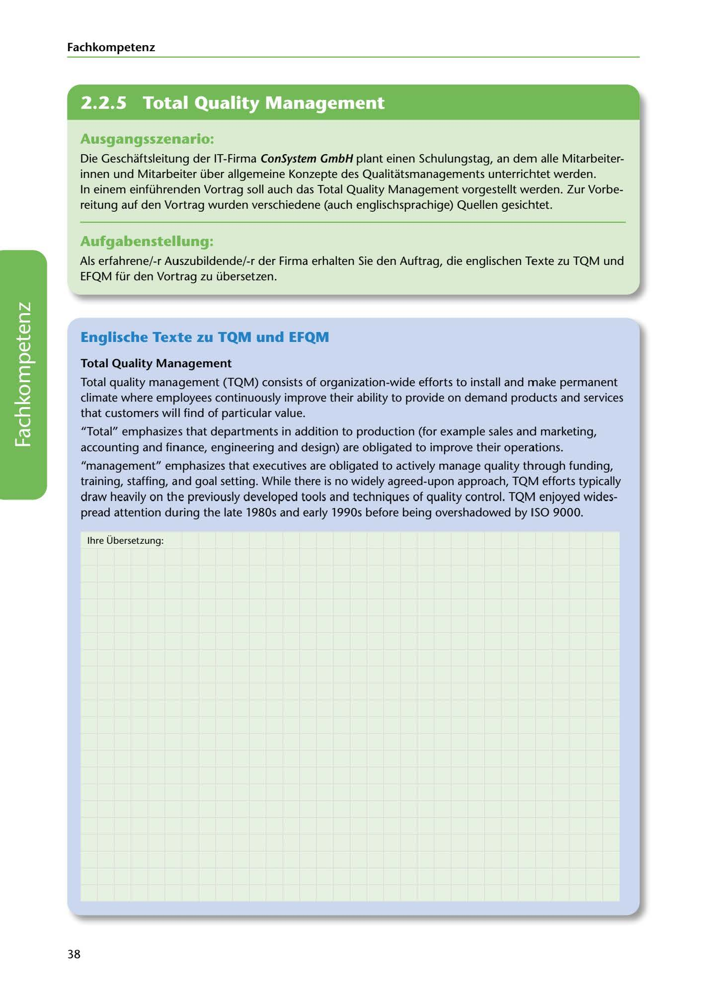

---
## Page 40
---

Fach kom petenz

<!-- IMAGE: page-040-img-1.jpeg - TODO: Add description -->

**[VISUAL: CONSYSTEM GMBH SCENARIO HEADER]**
Header image for the ConSystem GmbH TQM and EFQM translation exercise scenario.

### Ausgangsszenario:

Die Geschaftsleitung der IT-Firma ConSystem GmbH plant einen Schulungstag, an dem alle Mitarbeiter- innen und Mitarbeiter über allgemeine Konzepte des Qualitatsmanagements unterrichtet werden. In einem einführenden Vortrag soll auch das Total Quality Management vorgestellt werden. Zur Vorbe- reitung auf den Vortrag wurden verschiedene (auch englischsprachige) Quellen gesichtet.

### Aufgabenstellung:

Als erfahrene/-r Auszubildende/-r der Firma erhalten Sie den Auftrag, die englischen Texte zu TQM und EFQM für den Vortrag zu übersetzen.

### Englische Texte zu TQM und EFQM

### Total Quality Management

Total quality management (TQM) consists of organization-wide efforts to install and make permanent climate where employees continuously improve their ability to provide on demand products and services that customers will find of particular value.

"Total" emphasizes that departments in addition to production (for example sales and marketing, accounting and finance, engineering and design) are obligated to improve their operations.

**[VISUAL: ANSWER SPACE]**
Blank lined area for students to write their German translation of the TQM text.

"management" emphasizes that executives are obligated to actively manage quality through funding, training, staffing, and goal setting. While there is no widely agreed-upon approach, TQM efforts typically draw heavily on the previously developed tools and techniques of quality control. TQM enjoyed wides- pread attention during the late 1980s and early l 990s befare being overshadowed by ISO 9000.

lhre Übersetzung:

38
