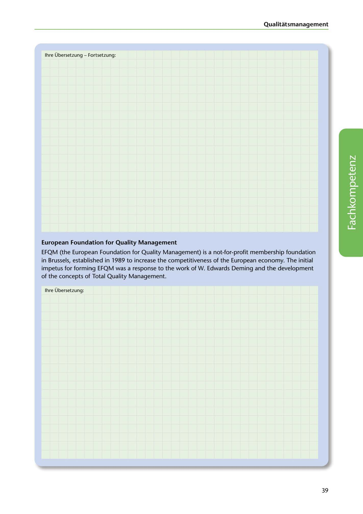

---
## Page 41
---

### Qualitatsmanagement

lhre Übersetzung - Fortsetzung:

### European Foundation for Quality Management

<!-- IMAGE: page-041-img-1.jpeg - TODO: Add description -->

**[VISUAL: ANSWER SPACE - CONTINUATION]**
Blank lined area for students to continue their German translation from the previous page.

EFQM (the European Foundation for Quality Management) is a not-for-profit membership foundation in Brussels, established in 1989 to increase the competitiveness of the European economy. The initial impetus for forming EFQM was a response to the work of W. Edwards Deming and the development of the concepts of Total Quality Management.

lhre Übersetzung:

39
