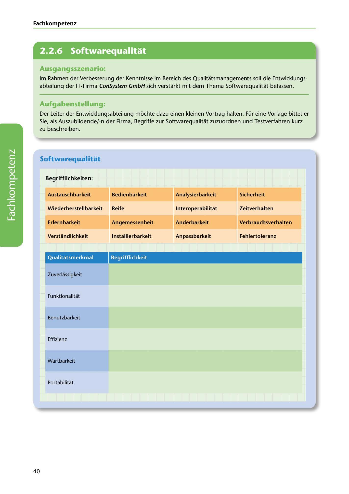

---
## Page 42
---

Fach kom petenz

<!-- IMAGE: page-042-img-1.jpeg - TODO: Add description -->

**[VISUAL: CONSYSTEM GMBH SCENARIO HEADER]**
Header image for the ConSystem GmbH software quality concepts exercise.

## Ausgangsszenario:

lm Rahmen der Verbesserung der Kenntnisse im Bereich des Qualitatsmanagements soll die Entwicklungs- abteilung der IT-Firma ConSystem GmbH sich verstarkt mit dem Thema Softwarequalitat befassen.

## Aufgabenstellung:

Der Leiter der Entwicklungsabteilung mochte dazu einen kleinen Vortrag halten. Für eine Vorlage bittet er Sie, als Auszubildende/-n der Firma, Begriffe zur Softwarequalitat zuzuordnen und Testverfahren kurz zu beschreiben.

## Softwarequalitat

Begrifflichkeiten:

### Austauschbarkeit

### Bedienbarkeit

### Analysierbarkeit

### Sicherheit

Wiederherstellbarkeit Reife

lnteroperabilitat

Zeitverhalten

### Erlernbarkeit

### Angemessenheit

### Anderbarkeit

### Verbrauchsverhalten

Verstandlichkeit lnstallierbarkeit

### Anpassbarkeit

### Fehlertoleranz

**[VISUAL: SOFTWARE QUALITY CHARACTERISTICS TABLE - EXERCISE]**
A matching exercise table where students assign software quality sub-characteristics (Austauschbarkeit, Bedienbarkeit, Analysierbarkeit, Sicherheit, Wiederherstellbarkeit, Reife, Interoperabilität, Zeitverhalten, Erlernbarkeit, Angemessenheit, Änderbarkeit, Verbrauchsverhalten, Verständlichkeit, Installierbarkeit, Anpassbarkeit, Fehlertoleranz) to the main quality characteristics:
- Zuverlässigkeit (Reliability)
- Funktionalität (Functionality)
- Benutzbarkeit (Usability)
- Effizienz (Efficiency)
- Wartbarkeit (Maintainability)
- Portabilität (Portability)

Qualitatsmerkmal Begrifflichkeit

Zuverlassigkeit

Funktionalitat

Benutzbarkeit

Effizienz

Wartbarkeit

Portabilitat

40
