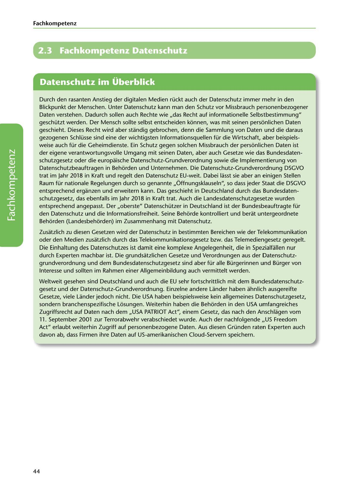

---
## Page 46
---

Fach kom petenz

# 2.3 Fachkompetenz Datenschutz

# Datenschutz im Überblick

Durch den rasanten Anstieg der digitalen Medien rückt auch der Datenschutz immer mehr in den Blickpunkt der Menschen. Unter Datenschutz kann man den Schutz vor Missbrauch personenbezogener Daten verstehen. Dadurch sollen auch Rechte wie ,,das Recht auf informationelle Selbstbestimmung" geschützt werden. Der Mensch sollte selbst entscheiden konnen, was mit seinen personlichen Daten geschieht. Dieses Recht wird aber standig gebrochen, denn die Sammlung von Daten und die daraus gezogenen Schlüsse sind eine der wichtigsten lnformationsquellen für die Wirtschaft, aber beispiels- weise auch für die Geheimdienste. Ein Schutz gegen solchen Missbrauch der personlichen Daten ist der eigene verantwortungsvolle Umgang mit seinen Daten, aber auch Gesetze wie das Bundesdaten- schutzgesetz oder die europaische Datenschutz-Grundverordnung sowie die lmplementierung von Datenschutzbeauftragen in Behorden und Unternehmen. Die Datenschutz-Grundverordnung DSGVO trat im Jahr 2018 in Kraft und regelt den Datenschutz EU-weit. Dabei lasst sie aber an einigen Stellen Raum für nationale Regelungen durch so genannte ,,Óffnungsklauseln", so dass jeder Staat die DSGVO entsprechend erganzen und erweitern kann. Das geschieht in Deutschland durch das Bundesdaten- schutzgesetz, das ebenfalls im Jahr 2018 in Kraft trat. Auch die Landesdatenschutzgesetze wurden entsprechend angepasst. Der ,,oberste" Datenschützer in Deutschland ist der Bundesbeauftragte für den Datenschutz und die lnformationsfreiheit. Seine Behorde kontrolliert und berat untergeordnete Behorden (Landesbehorden) im Zusammenhang mit Datenschutz.

<!-- IMAGE: page-046-img-1.jpeg - TODO: Add description -->

Zusatzlich zu diesen Gesetzen wird der Datenschutz in bestimmten Bereichen wie der Telekommunikation oder den Medien zusatzlich durch das Telekommunikationsgesetz bzw. das Telemediengesetz geregelt. Die Einhaltung des Datenschutzes ist damit eine komplexe Angelegenheit, die in Spezialfüllen nur durch Experten machbar ist. Die grundsatzlichen Gesetze und Verordnungen aus der Datenschutz- grundverordnung und dem Bundesdatenschutzgesetz sind aber für alle Bürgerinnen und Bürger von lnteresse und sollten im Rahmen einer Allgemeinbildung auch vermittelt werden.

Weltweit gesehen sind Deutschland und auch die EU sehr fortschrittlich mit dem Bundesdatenschutz- gesetz und der Datenschutz-Grundverordnung. Einzelne andere Lander haben ahnlich ausgereifte Gesetze, viele Lander jedoch nicht. Die USA haben beispielsweise kein allgemeines Datenschutzgesetz, sondern branchenspezifische Losungen. Weiterhin haben die Behorden in den USA umfangreiches Zugriffsrecht auf Daten nach dem ,,USA PATRIOT Act", einem Gesetz, das nach den Anschlagen vom 11. September 2001 zur Terrorabwehr verabschiedet wurde. Auch der nachfolgende ,,US Freedom Act" erlaubt weiterhin Zugriff auf personenbezogene Daten. Aus diesen Gründen raten Experten auch davon ab, dass Firmen ihre Daten auf US-amerikanischen Cloud-Servern speichern.

44
