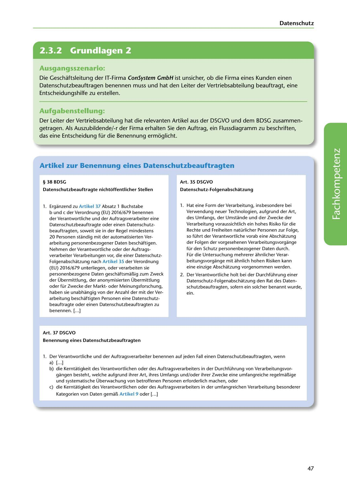

---
## Page 49
---

Datenschutz

<!-- IMAGE: page-049-img-1.jpeg - TODO: Add description -->

**[VISUAL: CONSYSTEM GMBH SCENARIO HEADER]**
Header image for the ConSystem GmbH data protection officer (Datenschutzbeauftragter) decision flowchart exercise.

### Ausgangsszenario:

Die Geschaftsleitung der IT-Firma ConSystem GmbH ist unsicher, ob die Firma eines Kunden einen Datenschutzbeauftragen benennen muss und hat den Leiter der Vertriebsabteilung beauftragt, eine Entscheidungshilfe zu erstellen.

### Aufgabenstellung:

Der Leiter der Vertriebsabteilung hat die relevanten Artikel aus der DSGVO und dem BDSG zusammen- getragen. Als Auszubildende/-r der Firma erhalten Sie den Auftrag, ein Flussdiagramm zu beschriften, das eine Entscheidung für die Benennung ermoglicht.

## Artikel zur Benennung eines Datenschutzbeauftragten

### § 38 BDSG

### Art. 35 DSGVO

### Datenschutzbeauftragte nichtoffentlicher Stellen

### Datenschutz-Folgenabschatzung

### 1. Erganzend zu Artikel 37 Absatz 1 Buchstabe

b und e der Verordnung (EU) 2016/679 benennen der Verantwortliche und der Auftragsverarbeiter eine

**[VISUAL: DATA PROTECTION OFFICER DECISION FLOWCHART - EXERCISE]**
A blank flowchart template for students to create a decision tree for determining when a Data Protection Officer (Datenschutzbeauftragter) must be appointed, based on DSGVO Art. 35, Art. 37, and BDSG § 38. The flowchart should help organizations determine their legal obligations regarding DPO appointment.

1. Hat eine Form der Verarbeitung, insbesondere bei Verwendung neuer Technologien, aufgrund der Art, des Umfangs, der Umstande und der Zwecke der Verarbeitung voraussichtlich ein hohes Risiko für die Rechte und Freiheiten natürlicher Personen zur Folge, so führt der Verantwortliche vorab eine Abschatzung der Folgen der vorgesehenen Verarbeitungsvorgange für den Schutz personenbezogener Daten durch. Für die Untersuchung mehrerer ahnlicher Verar- beitungsvorgange mit ahnlich hohen Risiken kann eine einzige Abschatzung vorgenommen werden.

2. Der Verantwortliche holt bei der Durchführung einer

Datenschutz-Folgenabschatzung den Rat des Daten- schutzbeauftragten, sofern ein solcher benannt wurde, ein.

### Folgenabschatzung nach Artikel 35 der Verordnung

Datenschutzbeauftragte oder einen Datenschutz- beauftragten, soweit sie in der Regel mindestens 20 Personen standig mit der automatisierten Ver- arbeitung personenbezogener Daten beschaftigen. Nehmen der Verantwortliche oder der Auftrags- verarbeiter Verarbeitungen vor, die einer Datenschutz- (EU) 2016/679 unterliegen, oder verarbeiten sie personenbezogene Daten geschaftsmal!.ig zum Zweck der Übermittlung, der anonymisierten Übermittlung oder für Zwecke der Marktoder Meinungsforschung, haben sie unabhangig von der Anzahl der mit der Ver- arbeitung beschaftigten Personen eine Datenschutz- beauftragte oder einen Datenschutzbeauftragten zu 1 benennen. [ ... ]

### Art. 37 DSGVO

### Benennung eines Datenschutzbeauftragten

1. Der Verantwortliche und der Auftragsverarbeiter benennen auf jeden Fall einen Datenschutzbeauftragten, wenn a) [ ... ] b) die Kerntatigkeit des Verantwortlichen oder des Auftragsverarbeiters in der Durchführung von Verarbeitungsvor-

gangen besteht, welche aufgrund ihrer Art, ihres Umfangs und/oder ihrer Zwecke eine umfangreiche regelmal!.ige und systematische Überwachung von betroffenen Personen erforderlich machen, oder e) die Kerntatigkeit des Verantwortlichen oder des Auftragsverarbeiters in der umfangreichen Verarbeitung besonderer

### Kategorien von Daten ge mar.. Artikel 9 oder [ ... ]

1

47
