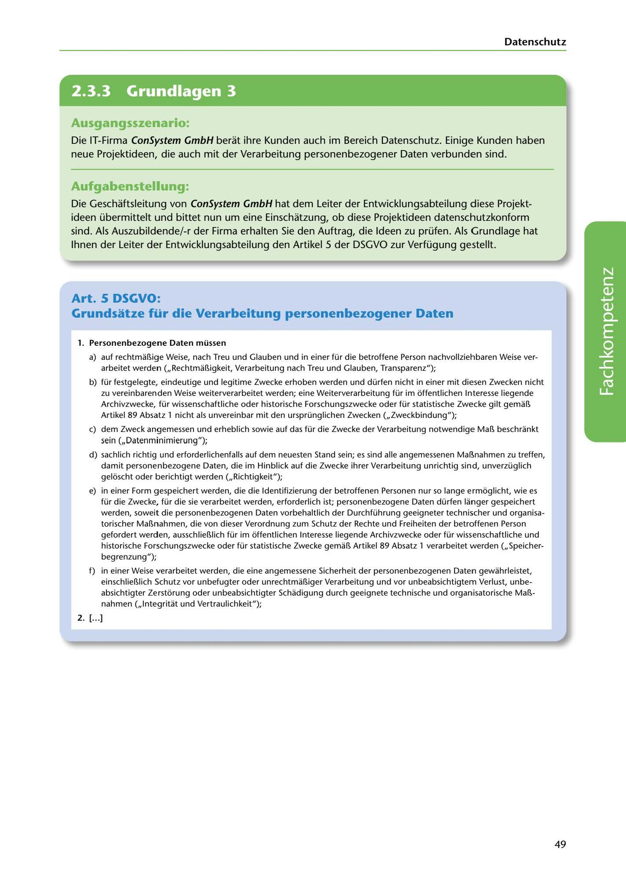

---
## Page 51
---

Datenschutz

<!-- IMAGE: page-051-img-1.jpeg - TODO: Add description -->

**[VISUAL: CONSYSTEM GMBH SCENARIO HEADER]**
Header image for the ConSystem GmbH GDPR compliance assessment exercise.

### Ausgangsszenario:

Die IT-Firma ConSystem GmbH berat ihre Kunden auch im Bereich Datenschutz. Einige Kunden haben neue Projektideen, die auch mit der Verarbeitung personenbezogener Daten verbunden sind.

### Aufgabenstellung:

Die Geschaftsleitung von ConSystem GmbH hat dem Leiter der Entwicklungsabteilung diese Projekt- ideen übermittelt und bittet nun um eine Einschatzung, ob diese Projektideen datenschutzkonform sind. Als Auszubildende/-r der Firma erhalten Sie den Auftrag, die Ideen zu prüfen. Als Grundlage hat lhnen der Leiter der Entwicklungsabteilung den Artikel 5 der DSGVO zur Verfügung gestellt.

## Art. 5 DSGVO:

## Grundsatze für die Verarbeitung personenbezogener Daten

### 1. Personenbezogene Daten müssen

a) auf rechtmall.ige Weise, nach Treu und Glauben und in einer für die betroffene Person nachvollziehbaren Weise ver- arbeitet werden (,,Rechtmall.igkeit, Verarbeitung nach Treu und Glauben, Transparenz");

b) für festgelegte, eindeutige und legitime Zwecke erhoben werden und dürfen nicht in einer mit diesen Zwecken nicht

zu vereinbarenden Weise weiterverarbeitet werden; eine Weiterverarbeitung für im éitfentlichen lnteresse liegende Archivzwecke, für wissenschaftliche oder historische Forschungszwecke oder für statistische Zwecke gilt gemall. Artikel 89 Absatz 1 nicht als unvereinbar mit den ursprünglichen Zwecken (,,Zweckbindung");

e) dem Zweck angemessen und erheblich sowie auf das für die Zwecke der Verarbeitung notwendige Mall. beschrankt

**[VISUAL: GDPR ARTICLE 5 REFERENCE TEXT]**
Continuation of the GDPR Article 5 principles text, highlighting the data minimization principle.

sein (,,Datenminimierung");

d) sachlich richtig und erforderlichenfalls auf dem neuesten Stand sein; es sind alle angemessenen Mal!nahmen zu treffen, damit personenbezogene Daten, die im Hinblick auf die Zwecke ihrer Verarbeitung unrichtig sind, unverzüglich geléischt oder berichtigt werden (,,Richtigkeit");

e) in einer Form gespeichert werden, die die ldentifizierung der betroffenen Personen nur so lange erméiglicht, wie es für die Zwecke, für die sie verarbeitet werden, erforderlich ist; personenbezogene Daten dürfen langer gespeichert werden, soweit die personenbezogenen Daten vorbehaltlich der Durchführung geeigneter technischer und organisa- torischer Mall.nahmen, die von dieser Verordnung zum Schutz der Rechte und Freiheiten der betroffenen Person gefordert werden, ausschliell.lich für im éiffentlichen lnteresse liegende Archivzwecke oder für wissenschaftliche und historische Forschungszwecke oder für statistische Zwecke gemall. Artikel 89 Absatz 1 verarbeitet werden (,,Speicher- begrenzung");

f) in einer Weise verarbeitet werden, die eine angemessene Sicherheit der personenbezogenen Daten gewahrleistet,

einschliell.lich Schutz vor unbefugter oder unrechtmall.iger Verarbeitung und vor unbeabsichtigtem Verlust, unbe- absichtigter Zerstéirung oder unbeabsichtigter Schadigung durch geeignete technische und organisatorische Mall.- nahmen (,,lntegritat und Vertraulichkeit");

2. [ ... ]

49
