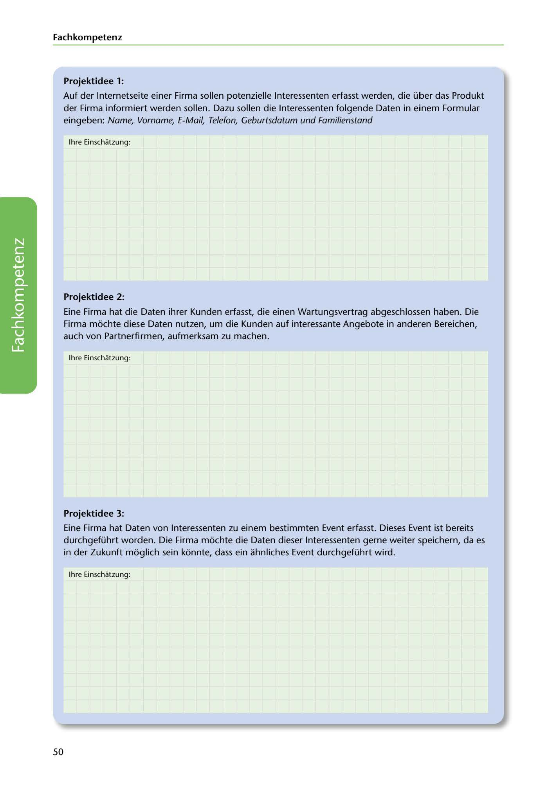

---
## Page 52
---

### Fach kom petenz

### Projektidee 1:

Auf der lnternetseite einer Firma sallen potenzielle lnteressenten erfasst werden, die über das Produkt

der Firma informiert werden sallen. Dazu sallen die lnteressenten folgende Daten in einem Formular eingeben: Name, Vorname, E-Mail, Telefon, Geburtsdatum und Familienstand

lhre Einschatzung:

### Projektidee 2:

Eine Firma hat die Daten ihrer Kunden erfasst, die einen Wartungsvertrag abgeschlossen haben. Die Firma mochte diese Daten nutzen, um die Kunden auf interessante Angebote in anderen Bereichen, auch von Partnerfirmen, aufmerksam zu machen.

lhre Einschatzung:

<!-- IMAGE: page-052-img-1.jpeg - TODO: Add description -->

**[VISUAL: ANSWER SPACE]**
Blank lined areas for students to provide their GDPR compliance assessment of the presented project ideas.

### Projektidee 3:

Eine Firma hat Daten von lnteressenten zu einem bestimmten Event erfasst. Dieses Event ist bereits durchgeführt worden. Die Firma mochte die Daten dieser lnteressenten gerne weiter speichern, da es in der Zukunft moglich sein konnte, dass ein ahnliches Event durchgeführt wird.

lhre Einschatzung:

50
