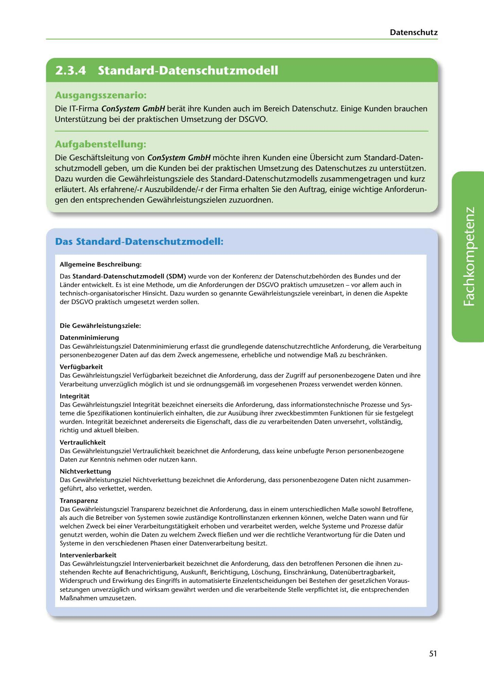

---
## Page 53
---

Datenschutz

<!-- IMAGE: page-053-img-1.jpeg - TODO: Add description -->

**[VISUAL: CONSYSTEM GMBH SCENARIO HEADER]**
Header image for the ConSystem GmbH Standard Data Protection Model (SDM) exercise.

## Ausgangsszenario:

Die IT-Firma ConSystem GmbH berat ihre Kunden auch im Bereich Datenschutz. Einige Kunden brauchen Unterstützung bei der praktischen Umsetzung der DSGVO.

## Aufgabenstellung:

Die Geschaftsleitung van ConSystem GmbH mochte ihren Kunden eine Übersicht zum Standard-Daten- schutzmodell geben, um die Kunden bei der praktischen Umsetzung des Datenschutzes zu unterstützen. Dazu wurden die Gewahrleistungsziele des Standard-Datenschutzmodells zusammengetragen und kurz erlautert. Als erfahrene/-r Auszubildende/-r der Firma erhalten Sie den Auftrag, einige wichtige Anforderun- gen den entsprechenden Gewahrleistungszielen zuzuordnen.

## Das Standard-Datenschutzmodell:

### Allgemeine Beschreibung:

Das Standard-Datenschutzmodell (SDM) wurde von der Konferenz der Datenschutzbehorden des Bundes und der Lander entwickelt. Es ist eine Methode, um die Anforderungen der DSGVO praktisch umzusetzen - vor allem auch in technisch-organisatorischer Hinsicht. Dazu wurden so genannte Gewahrleistungsziele vereinbart, in denen die Aspekte der DSGVO praktisch umgesetzt werden sallen.

### Die Gewahrleistungsziele:

**[VISUAL: SDM PROTECTION GOALS OVERVIEW]**
Visual representation of the Standard Data Protection Model (Standard-Datenschutzmodell) showing the seven protection goals (Gewährleistungsziele): Datenminimierung, Verfügbarkeit, Integrität, Vertraulichkeit, Nichtverkettung, Transparenz, and Intervenierbarkeit.

### Datenminimierung

Das Gewahrleistungsziel Datenminimierung erfasst die grundlegende datenschutzrechtliche Anforderun-g, die Verarbeitung personenbezogener Daten auf das dem Zweck angemessene, erhebliche und notwendige Mal!. zu beschranken.

### Verfügbarkeit

Das Gewahrleistungsziel Verfügbarkeit bezeichnet die Anforderung, dass der Zugriff auf personenbezogene Daten und ihre Verarbeitung unverzüglich moglich ist und sie ordnungsgemal!, im vorgesehenen Prozess verwendet werden kónnen.

### lntegritat

Das Gewahrleistungsziel lntegritat bezeichnet einerseits die Anforderung, dass informationstechnische Prozesse und Sys- teme die Spezifikationen kontinuierlich einhalten, die zur Ausübung ihrer zweckbestimmten Funktionen für sie festgelegt wurden. lntegritat bezeichnet andererseits die Eigenschaft, dass die zu verarbeitenden Daten unversehrt, vollstandig, richtig und aktuell bleiben.

### Vertraulichkeit

Das Gewahrleistungsziel Vertraulichkeit bezeichnet die Anforderung, dass keine unbefugte Person perso11enbezogene Daten zur Kenntnis nehmen oder nutzen kann.

### Nichtverkettung

Das Gewahrleistungsziel Nichtverkettung bezeichnet die Anforderung, dass personenbezogene Daten nicht zusammen- geführt, also verkettet, werden.

### Transparenz

Das Gewahrleistungsziel Transparenz bezeichnet die Anforderung, dass in einem unterschiedlichen Mal!.e sowohl Betroffene, als auch die Betreiber van Systemen sowie zustandige Kontrollinstanzen erkennen konnen, welche Daten wann und für welchen Zweck bei einer Verarbeitungstatigkeit erhoben und verarbeitet werden, welche Systeme und Prozesse dafür genutzt werden, wohin die Daten zu welchem Zweck fliel!.en und wer die rechtliche Verantwortung für die Daten und Systeme in den verschiedenen Phasen einer Datenverarbeitung besitzt.

### lntervenierbarkeit

Das Gewahrleistungsziel lntervenierbarkeit bezeichnet die Anforderung, dass den betroffenen Personen die ihnen zu- stehenden Rechte auf Benachrichtigung, Auskunft, Berichtigung, Lóschung, Einschrankung, Datenübertragbarkeit, Widerspruch und Erwirkung des Eingriffs in automatisierte Einzelentscheidungen bei Bestehen der gesetzlichen Voraus- setzungen unverzüglich und wirksam gewahrt werden und die verarbeitende Stelle verpflichtet ist, die entsprechenden Mal!.nahmen umzusetzen.

51
