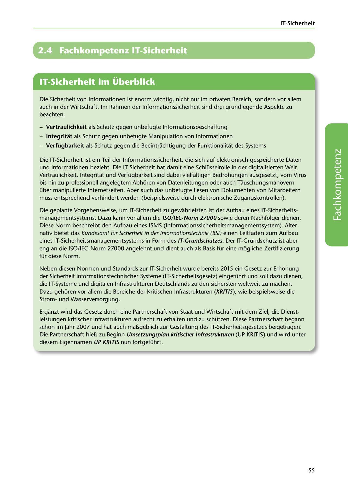

---
## Page 57
---

IT-Sicherheit

# 2.4 Fachkompetenz IT-Sicherheit

<!-- IMAGE: page-057-img-1.jpeg - TODO: Add description -->

**[VISUAL: IT SECURITY SECTION HEADER]**
Chapter header image for "2.4 Fachkompetenz IT-Sicherheit" (Professional Competency in IT Security) section, with security-themed graphics such as locks, shields, or digital protection symbols.

Die Sicherheit von lnformationen ist enorm wichtig, nicht nur im privaten Bereich, sondern vor allem auch in der Wirtschaft. lm Rahmen der lnformationssicherheit sind drei grundlegende Aspekte zu beachten:

- Vertraulichkeit als Schutz gegen unbefugte lnformationsbeschaffung

- lntegritat als Schutz gegen unbefugte Manipulation von lnformationen

- Verfügbarkeit als Schutz gegen die Beeintrachtigung der Funktionalitat des Systems

Die IT-Sicherheit ist ein Teil der lnformationssicherheit, die sich auf elektronisch gespeicherte Daten und lnformationen bezieht. Die IT-Sicherheit hat damit eine Schlüsselrolle in der digitalisierten Welt. Vertraulichkeit, lntegritat und Verfügbarkeit sind dabei vielfaltigen Bedrohungen ausgesetzt, vom Virus bis hin zu professionell angelegtem Abhoren von Datenleitungen oder auch Tauschungsmanovern über manipulierte lnternetseiten. Aber auch das unbefugte Lesen von Dokumenten von Mitarbeitern muss entsprechend verhindert werden (beispielsweise durch elektronische Zugangskontrollen).

**[VISUAL: CIA TRIAD / INFORMATION SECURITY TRIANGLE]**
Diagram showing the three fundamental aspects of information security (CIA Triad):
- Vertraulichkeit (Confidentiality)
- Integrität (Integrity)
- Verfügbarkeit (Availability)
These three pillars form the foundation of IT security concepts.

Die geplante Vorgehensweise, um IT-Sicherheit zu gewahrleisten ist der Aufbau eines IT-Sicherheits- managementsystems. Dazu kann vor allem die /SO/ IEC-Norm 27000 sowie deren Nachfolger dienen. Diese Norm beschreibt den Aufbau eines ISMS (lnformationssicherheitsmanagementsystem). Alter- nativ bietet das Bundesamt für Sicherheit in der lnformationstechnik (BSI) einen Leitfaden zum Aufbau eines IT-Sicherheitsmanagementsystems in Form des IT-Grundschutzes. Der IT-Grundschutz ist aber eng an die ISO/IEC-Norm 27000 angelehnt und dient auch als Basis für eine mogliche Zertifizierung für diese Norm.

Neben diesen Normen und Standards zur IT-Sicherheit wurde bereits 2015 ein Gesetz zur Erhohung der Sicherheit informationstechnischer Systeme (IT-Sicherheitsgesetz) eingeführt und soll dazu dienen, die IT-Systeme und digitalen lnfrastrukturen Deutschlands zu den sichersten weltweit zu machen.

Dazu gehoren vor allem die Bereiche der Kritischen lnfrastrukturen (KRITIS), wie beispielsweise die Stromund Wasserversorgung.

Erganzt wird das Gesetz durch eine Partnerschaft von Staat und Wirtschaft mit dem Ziel, die Dienst- leistungen kritischer lnfrastrukturen aufrecht zu erhalten und zu schützen. Diese Partnerschaft begann schon im Jahr 2007 und hat auch maí!.geblich zur Gestaltung des IT-Sicherheitsgesetzes beigetragen.

### diesem Eigennamen UP KRITIS nun fortgeführt.

Die Partnerschaft hiel'!, zu Beginn Umsetzungsplan kritischer lnfrastrukturen (UP KRITIS) und wird unter

55
