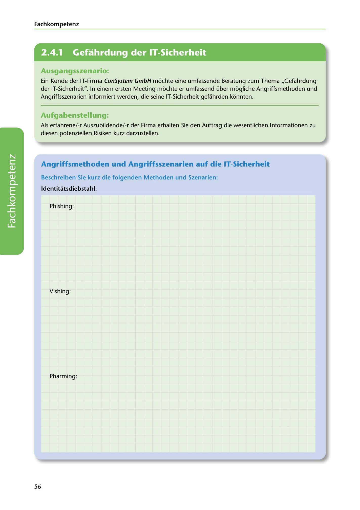

---
## Page 58
---

Fach kom petenz

<!-- IMAGE: page-058-img-1.jpeg - TODO: Add description -->

**[VISUAL: CONSYSTEM GMBH SCENARIO HEADER]**
Header image for the ConSystem GmbH IT security threats and attack methods exercise.

## Ausgangsszenario:

Ein Kunde der IT-Firma ConSystem GmbH mochte eine umfassende Beratung zum Thema ,,Gefahrdung der IT-Sicherheit". In einem ersten Meeting mochte er umfassend über mogliche Angriffsmethoden und Angriffsszenarien informiert werden, die seine IT-Sicherheit geführden konnten.

## Aufgabenstellung:

Als erfahrene/-r Auszubildende/-r der Firma erhalten Sie den Auftrag die wesentlichen lnformationen zu diesen potenziellen Risiken kurz darzustellen.

## Angriffsmethoden und Angriffsszenarien auf die IT-Sicherheit

### Beschreiben Sie kurz die folgenden Methoden und Szenarien:

### ldentitatsdiebstahl:

Phishing:

**[VISUAL: ANSWER SPACE]**
Blank lined area for students to describe Phishing attack methods.

Vishing:

Pharming:

56
