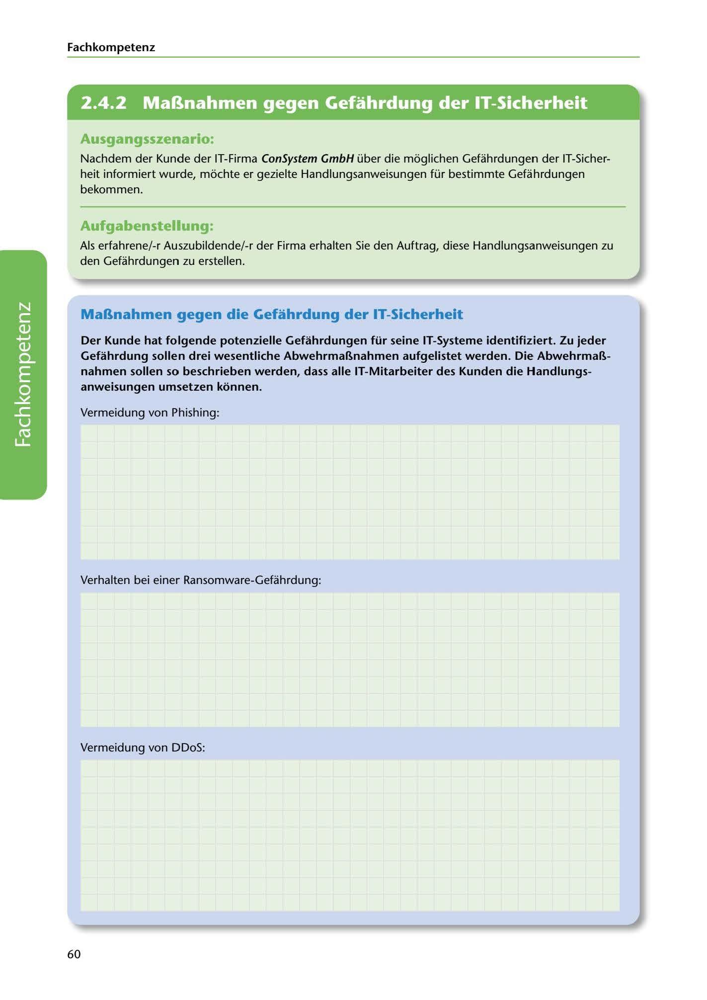

---
## Page 62
---

Fach kom petenz

<!-- IMAGE: page-062-img-1.jpeg - TODO: Add description -->

**[VISUAL: CONSYSTEM GMBH SCENARIO HEADER]**
Header image for the ConSystem GmbH IT security countermeasures exercise.

### Ausgangsszenario:

Nachdem der Kunde der IT-Firma ConSystem GmbH über die moglichen Gefahrdungen der IT-Sicher- heit informiert wurde, mochte er gezielte Handlungsanweisungen für bestimmte Gefahrdungen bekommen.

### Aufgabenstellung:

Als erfahrene/-r Auszubildende/-r der Firma erhalten Sie den Auftrag, diese Handlungsanweisungen zu den Gefahrdungen zu erstellen.

## MaBnahmen gegen die Gefahrdung der IT-Sicherheit

### anweisungen umsetzen konnen.

Der Kunde hat folgende potenzielle Gefahrdungen für seine IT-Systeme identifiziert. Zu jeder Gefahrdung sollen drei wesentliche AbwehrmaBnahmen aufgelistet werden. Die AbwehrmaB- nahmen sollen so beschrieben werden, dass alle IT-Mitarbeiter des Kunden die Handlungs-

Vermeidung von Phishing:

**[VISUAL: ANSWER SPACE]**
Blank lined area for students to list three countermeasures against Phishing attacks.

Verhalten bei einer Ransomware-Gefahrdung:

Vermeidung von DDoS:

60
