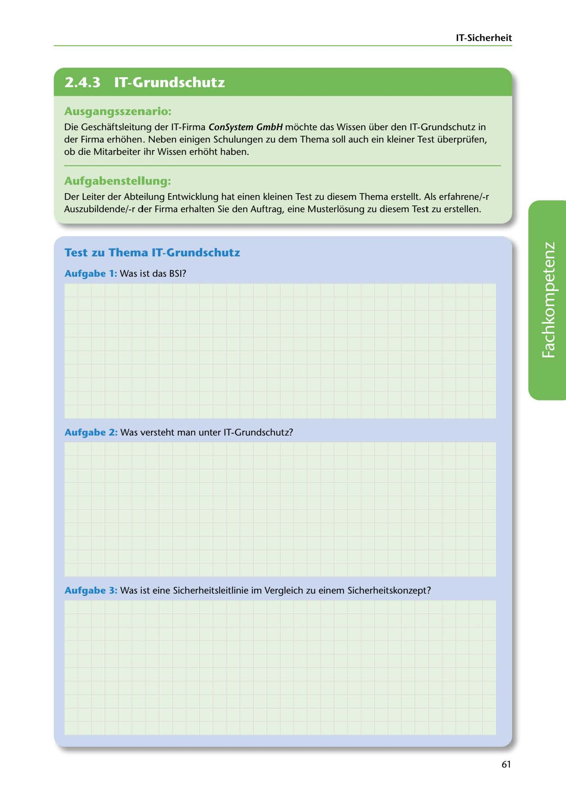

---
## Page 63
---

IT-Sicherheit

<!-- IMAGE: page-063-img-1.jpeg - TODO: Add description -->

**[VISUAL: CONSYSTEM GMBH SCENARIO HEADER]**
Header image for the ConSystem GmbH BSI IT-Grundschutz test exercise.

## Ausgangsszenario:

Die Geschaftsleitung der IT-Firma ConSystem GmbH mochte das Wissen über den IT-Grundschutz in der Firma erhohen. Neben einigen Schulungen zu dem Thema soll auch ein kleiner Test überprüfen, ob die Mitarbeiter ihr Wissen erhoht haben.

## Aufgabenstellung:

Der Leiter der Abteilung Entwicklung hat einen kleinen Test zu diesem Thema erstellt. Als erfahrene/-r Auszubildende/-r der Firma erhalten Sie den Auftrag, eine Musterlosung zu diesem Test zu erstellen.

## Test zu Thema IT-Grundschutz

### Aufgabe 1: Was ist das BSI?

**[VISUAL: ANSWER SPACE]**
Blank lined area for students to explain what BSI (Bundesamt für Sicherheit in der Informationstechnik) is.

### Aufgabe 2: Was versteht man unter IT-Grundschutz?

Aufgabe 3: Was ist eine Sicherheitsleitlinie im Vergleich zu einem Sicherheitskonzept?

61
