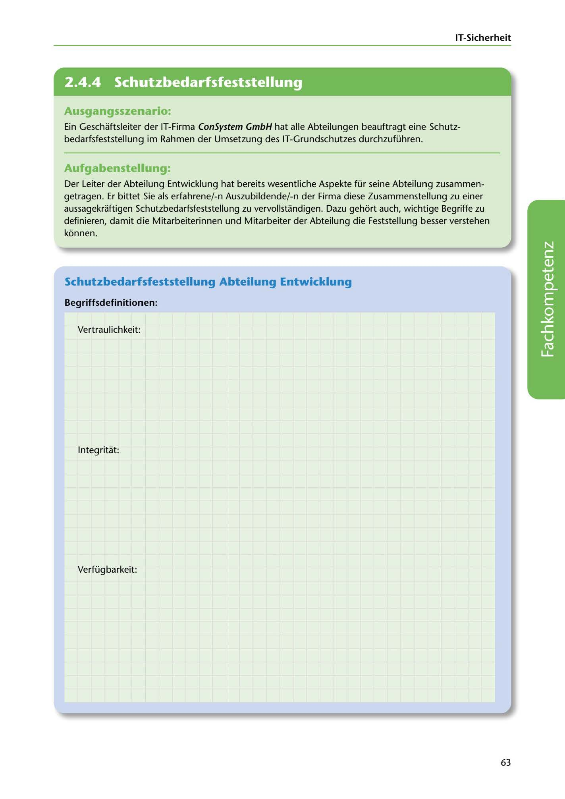

---
## Page 65
---

### IT-Sicherheit

<!-- IMAGE: page-065-img-1.jpeg - TODO: Add description -->

**[VISUAL: CONSYSTEM GMBH SCENARIO HEADER]**
Header image for the ConSystem GmbH protection needs assessment (Schutzbedarfsfeststellung) exercise.

## Ausgangsszenario:

Ein Geschaftsleiter der IT-Firma ConSystem GmbH hat alle Abteilungen beauftragt eine Schutz- bedarfsfeststellung im Rahmen der Umsetzung des IT-Grundschutzes durchzuführen.

## Aufgabenstellung:

Der Leiter der Abteilung Entwicklung hat bereits wesentliche Aspekte für seine Abteilung zusammen- getragen. Er bittet Sie als erfahrene/-n Auszubildende/-n der Firma diese Zusammenstellung zu einer aussagekraftigen Schutzbedarfsfeststellung zu vervollstandigen. Dazu gehort auch, wichtige Begriffe zu definieren, damit die Mitarbeiterinnen und Mitarbeiter der Abteilung die Feststellung besser verstehen konnen.

## Schutzbedarfsfeststellung Abteilung Entwicklung

### Begriffsdefinitionen:

Vertraulichkeit:

**[VISUAL: ANSWER SPACE]**
Blank lined areas for students to define the three security goals: Vertraulichkeit (Confidentiality), Integrität (Integrity), and Verfügbarkeit (Availability).

1 nteg ritat:

Verfüg barkeit:

63
