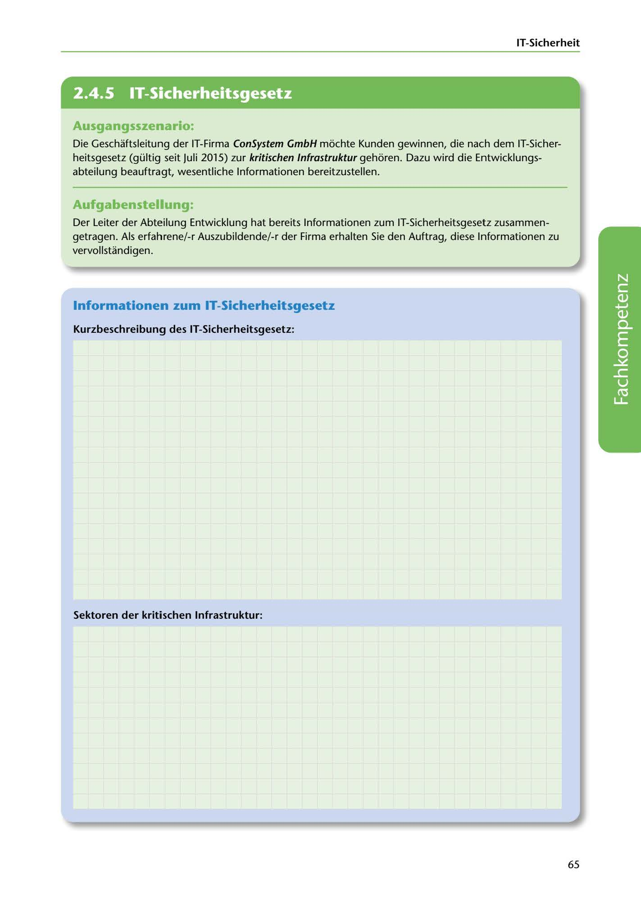

---
## Page 67
---

IT-Sicherheit

<!-- IMAGE: page-067-img-1.jpeg - TODO: Add description -->

**[VISUAL: CONSYSTEM GMBH SCENARIO HEADER]**
Header image for the ConSystem GmbH IT Security Law (IT-Sicherheitsgesetz) and critical infrastructure (KRITIS) exercise.

## Ausgangsszenario:

Die Geschaftsleitung der IT-Firma ConSystem GmbH mochte Kunden gewinnen, die nach dem IT-Sicher- heitsgesetz (gültig seit Juli 2015) zur kritischen lnfrastruktur gehoren. Dazu wird die Entwicklungs- abteilung beauftragt, wesentliche lnformationen bereitzustellen.

## Aufgabenstellung:

Der Leiter der Abteilung Entwicklung hat bereits lnformationen zum IT-Sicherheitsgesetz zusammen- getragen. Als erfahrene/-r Auszubildende/-r der Firma erhalten Sie den Auftrag, diese lnformationen zu vervollstandigen.

## lnformationen zum IT-Sicherheitsgesetz

Kurzbeschreibung des IT-Sicherheitsgesetz:

**[VISUAL: ANSWER SPACE]**
Blank lined area for students to provide a brief description of the IT Security Law (IT-Sicherheitsgesetz) and list the critical infrastructure sectors (KRITIS sectors).

Sektoren der kritischen lnfrastruktur:

65
