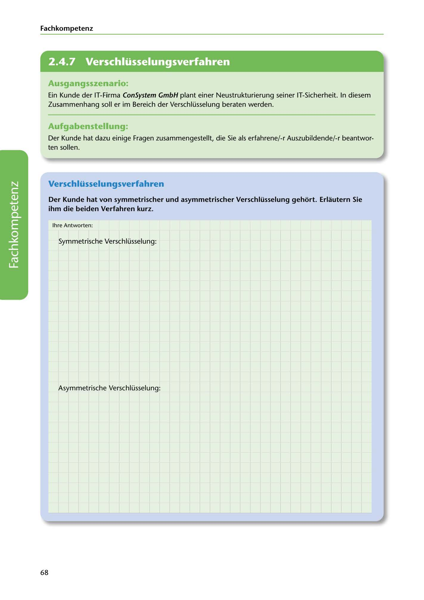

---
## Page 70
---

Fach kom petenz

<!-- IMAGE: page-070-img-1.jpeg - TODO: Add description -->

**[VISUAL: CONSYSTEM GMBH SCENARIO HEADER]**
Header image for the ConSystem GmbH encryption methods (Verschlüsselungsverfahren) exercise.

## Ausgangsszenario:

Ein Kunde der IT-Firma ConSystem GmbH plant einer Neustrukturierung seiner IT-Sicherheit. In diesem Zusammenhang soll er im Bereich der Verschlüsselung beraten werden.

## Aufgabenstellung:

Der Kunde hat dazu einige Fragen zusammengestellt, die Sie als erfahrene/-r Auszubildende/-r beantwor- ten sollen.

## Verschlüsselu ngsverfahren

### ihm die beiden Verfahren kurz.

Der Kunde hat von symmetrischer und asymmetrischer Verschlüsselung gehort. Erlautern Sie

lhre Antworten:

Symmetrische Verschlüsselung:

**[VISUAL: ANSWER SPACE]**
Blank lined area for students to explain symmetric encryption methods.

Asymmetrische Verschlüsselung:

68
