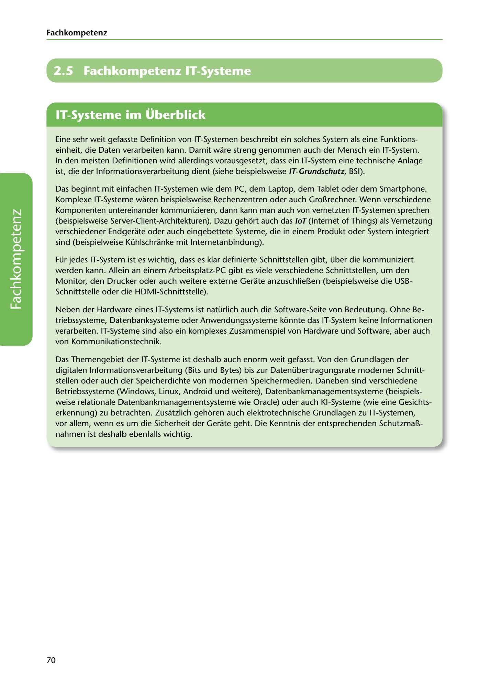

---
## Page 72
---

### Fach kom petenz

# 2.5 Fachkompetenz IT-Systeme

<!-- IMAGE: page-072-img-1.jpeg - TODO: Add description -->

**[VISUAL: IT SYSTEMS SECTION HEADER]**
Chapter header image for "2.5 Fachkompetenz IT-Systeme" (Professional Competency in IT Systems) section, featuring various IT hardware components and technology graphics.

Eine sehr weit gefasste Definition von IT-Systemen beschreibt ein solches System als eine Funktions- einheit, die Daten verarbeiten kann. Damit ware streng genommen auch der Mensch ein IT-System. In den meisten Definitionen wird allerdings vorausgesetzt, dass ein IT-System eine technische Anlage ist, die der lnformationsverarbeitung dient (siehe beispielsweise IT-Grundschutz, BSI).

Das beginnt mit einfachen IT-Systemen wie dem PC, dem Laptop, dem Tablet oder dem Smartphone. Komplexe IT-Systeme waren beispielsweise Rechenzentren oder auch Grol1rechner. Wenn verschiedene Komponenten untereinander kommunizieren, dann kann man auch von vernetzten IT-Systemen sprechen (beispielsweise Server-Client-Architekturen). Dazu gehort auch das /oT (Internet of Things) als Vernetzung verschiedener Endgerate oder auch eingebettete Systeme, die in einem Produkt oder System integriert sind (beispielweise Kühlschranke mit lnternetanbindung).

Für jedes IT-System ist es wichtig, dass es klar definierte Schnittstellen gibt, über die kommuniziert werden kann. Allein an einem Arbeitsplatz-PC gibt es viele verschiedene Schnittstellen, um den Monitor, den Drucker oder auch weitere externe Gerate anzuschliel1en (beispielsweise die USB- Schnittstelle oder die HDMI-Schnittstelle).

**[VISUAL: IT SYSTEM COMPONENTS DIAGRAM]**
Diagram illustrating the various components and interfaces of IT systems, including hardware (PC, laptop, tablet, smartphone), network connections, and external interfaces (USB, HDMI).

Neben der Hardware eines IT-Systems ist natürlich auch die Software-Seite von Bedeutung. Ohne Be- triebssysteme, Datenbanksysteme oder Anwendungssysteme konnte das IT-System keíne lnformationen verarbeiten. IT-Systeme sind also ein komplexes Zusammenspiel von Hardware und Software, aber auch von Kommunikationstechnik.

Das Themengebiet der IT-Systeme ist deshalb auch enorm weit gefasst. Von den Grundlagen der digitalen lnformationsverarbeitung (Bits und Bytes) bis zur Datenübertragungsrate moderner Schnitt- stellen oder auch der Speicherdichte von modernen Speichermedien. Daneben sind verschiedene

Betriebssysteme (Windows, Linux, Android und weitere), Datenbankmanagementsysteme (beispiels- weise relationale Datenbankmanagementsysteme wie Oracle) oder auch KI-Systeme (wie eine Gesichts- erkennung) zu betrachten. Zusatzlich gehoren auch elektrotechnische Grundlagen zu IT-Systemen, vor allem, wenn es um die Sicherheit der Gerate geht. Die Kenntnis der entsprechenden Schutzmal1- nahmen ist deshalb ebenfalls wichtig.

70
