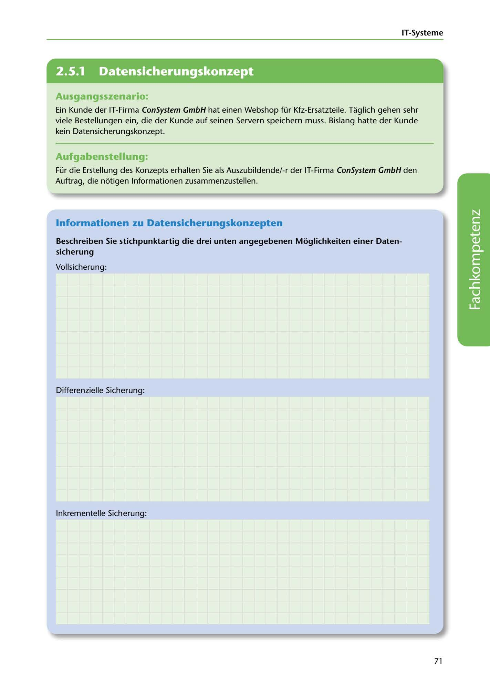

---
## Page 73
---

IT-Systerne

<!-- IMAGE: page-073-img-1.jpeg - TODO: Add description -->

**[VISUAL: CONSYSTEM GMBH SCENARIO HEADER]**
Header image for the ConSystem GmbH data backup concepts exercise.

## Ausgangsszenario:

Ein Kunde der IT-Firma ConSystem GmbH hat einen Webshop für Kfz-Ersatzteile. Taglich gehen sehr viele Bestellungen ein, die der Kunde auf seinen Servern speichern muss. Bislang hatte der Kunde kein Datensicherungskonzept.

## Aufgabenstellung:

Für die Erstellung des Konzepts erhalten Sie als Auszubildende/-r der IT-Firma ConSystem GmbH den Auftrag, die notigen lnformationen zusammenzustellen.

## lnformationen zu Datensicherungskonzepten

### sicherung

Beschreiben Sie stichpunktartig die drei unten angegebenen Moglichkeiten einer Daten-

Vollsicherung:

**[VISUAL: ANSWER SPACE]**
Blank lined area for students to describe the three backup methods: Vollsicherung (full backup), differenzielle Sicherung (differential backup), and inkrementelle Sicherung (incremental backup).

Differenzielle Sicherung:

lnkrementelle Sicherung:

71
